buuctf reserve板块部分wp的第二弹，持续更新ing
<!-- more -->
### [GXYCTF2019]luck_guy
例行查壳，64位的
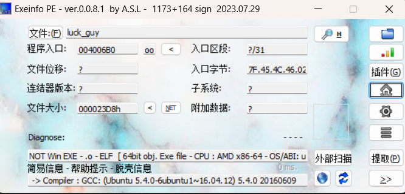
直接进主函数，然后一路找到flag位置
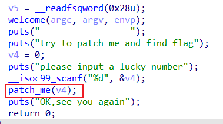
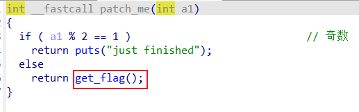
输出的是s，而s是由f1和f2位置存储的信息构成的，f1直接点进去就是注释的内容，f2则根据下面的case4，5有关f2的操作来确定内容。f2先是被case4存进内容，而此处\x7F是代表这是16进制，所以逆序存进去之后为注释内容。case5对存进去的字符串进行了处理。
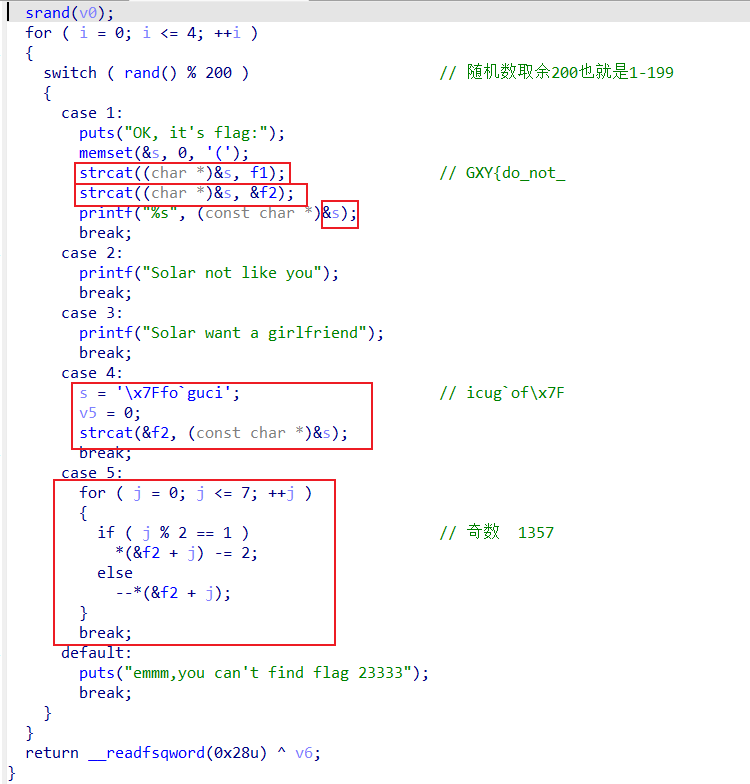
将逆序内容在脚本中进行处理即可得出f2
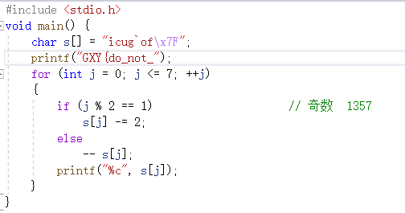
不得不提的是这个题目和这个答案感觉在给我喂刀，特意搜了一下solar一般表示英俊是男名，我承认ctf比一般的虐文小说好看
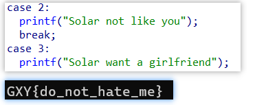
### JustRE
32位
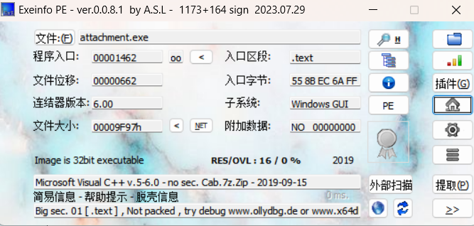
在字符串搜索没有看见flag和key等，翻了一下看见一个像flag的
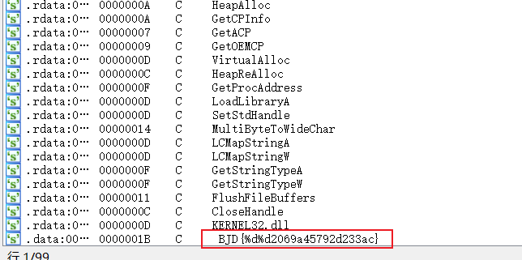
交叉引用查看函数
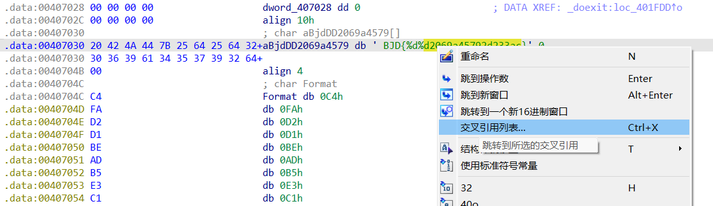
sprintf将内容复制到格式化字符串中，也就是19999和0复制进BDJ中替换%d，存入String
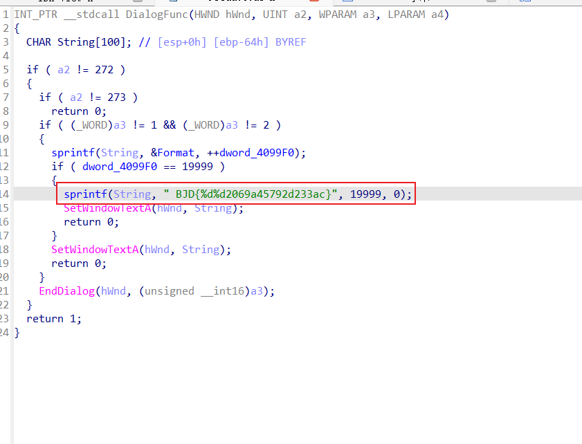
### 刮开有奖
看一眼，32位
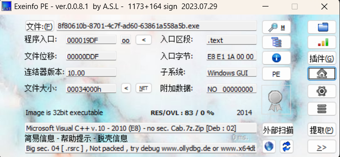
看见security那个函数应该是主函数附近的检查安全性的，点进去看看
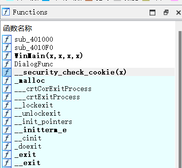
进入伪代码
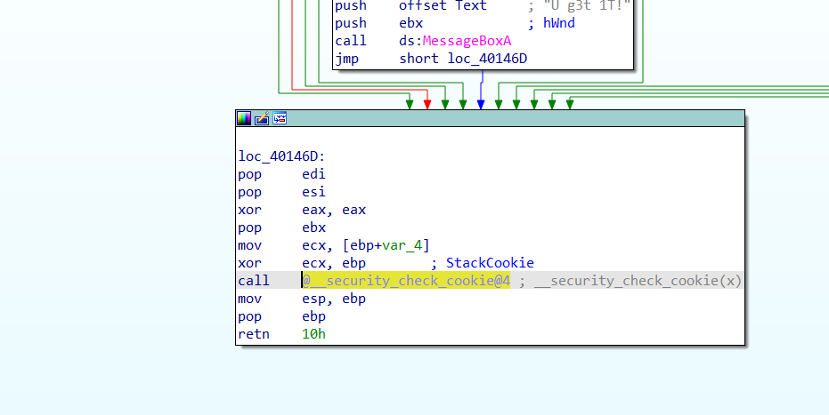
这里的v7->v16都是连续内存，后面存进了字符，然后sub_4010F0进行处理了，进去看一眼
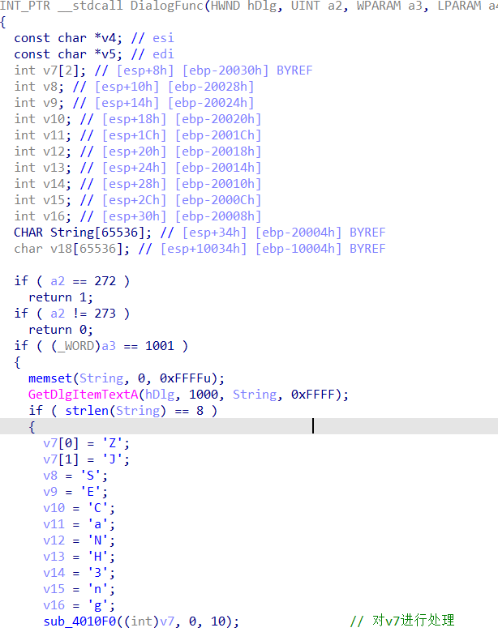
直接改成c代码看结果。这个地方的dword和*4这种表达是因为伪代码从汇编来的，默认为单字节，所以在c代码中注意将a1+i*4改为a1[i].
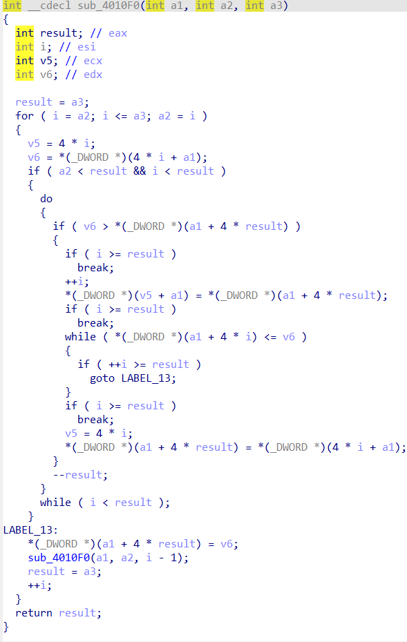
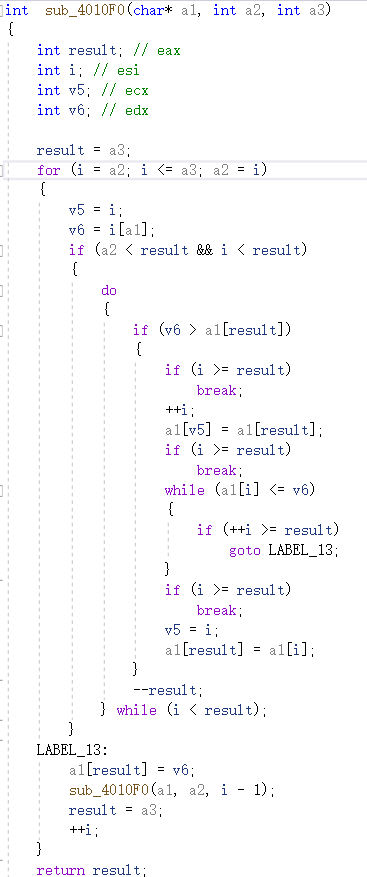
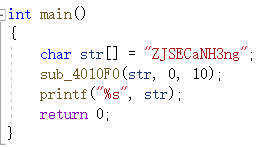
if处的string解决了，来看strcmp的内容v4和v5在前面都经过了401000的处理看一眼是啥
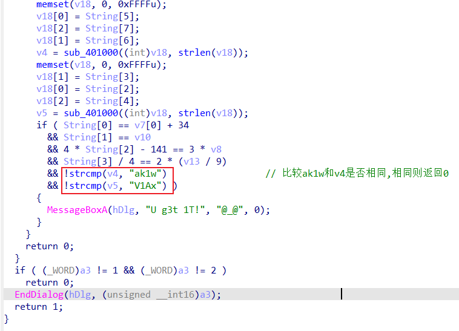
%3和后面的跟进看见的字符串猜测为base64，进行base64解码。
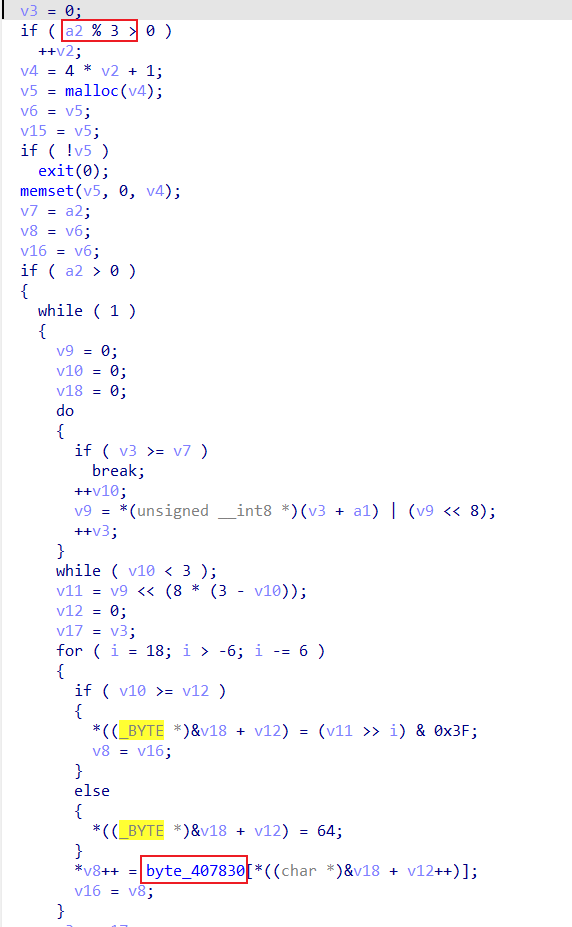
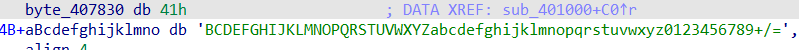
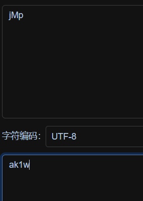 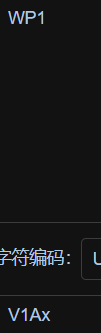
分析如注释，其中WP已经出现了所以尝试WP1放在前面。
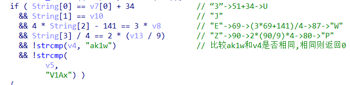
### 简单注册器
看一眼下载的是安卓的安装包，那么安装试一下看效果
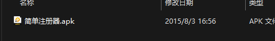
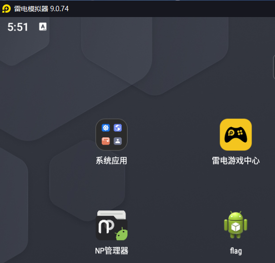
似乎是根据输入来输出所需要的注册码，进jadx找一下
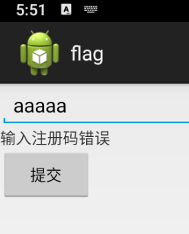
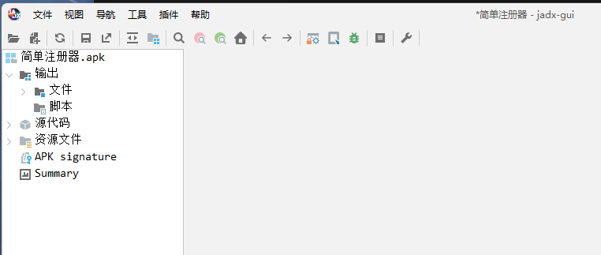
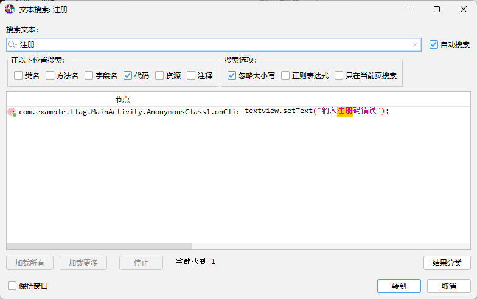
根据搜索到的内容确定位置到这个函数，在这个函数最后他输出了flag
这里有两种方式第一种根据第一次if的判断随意编写一个结尾为a，第二位为b长度为32，并且符合第一位加第三位为48+56
第二种方式是将第二个if所给出的字符串按照第二个if的规则进行处理直接得到flag
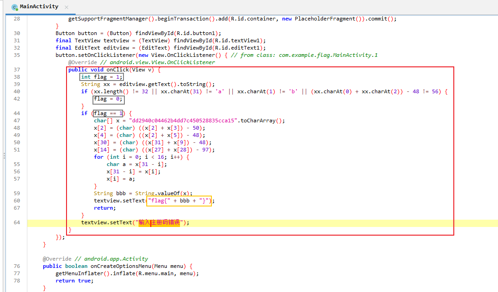
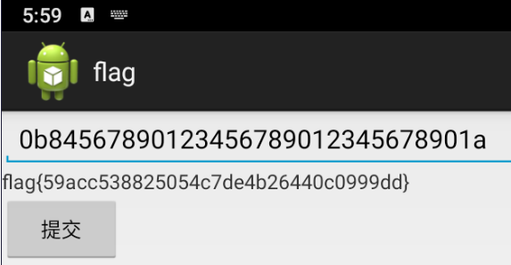