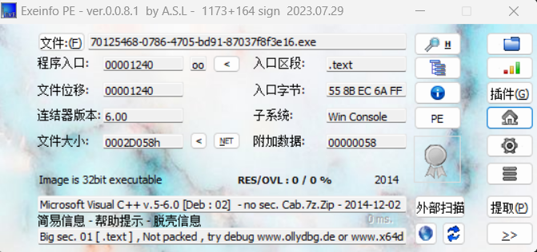
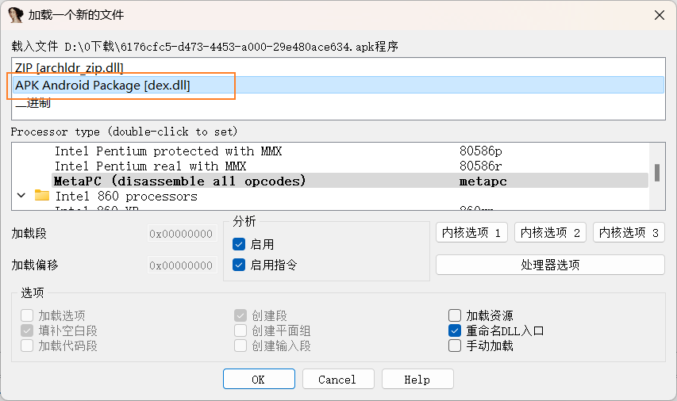
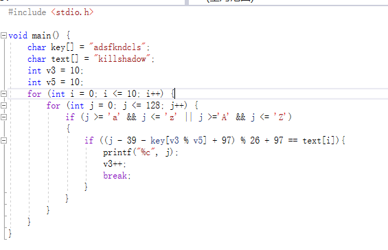

buuctf reserve板块的一些write up
<!-- more -->
### reserve1
先运行程序看看是个什么东西,然后看看是多少位的程序

进入ida，我们在一开始运行该程序的时候看见了输入flag的提示，所以我们可以直接尝试搜索flag字符串，这里用快捷键shift+f12查看字符串，然后搜索字符串。

然后进入我们找到的地方，这里写的错误flag，可见这哥字符串调用附近又flag判断，我们点进去看看，点开后选择交叉引用，进入引用这个的程序处。

进入这个地方后，我们稍微看看这个逻辑。再引用wrong flag之前有一个分叉，应该是检测是否为正确的flag，调用了strncmp来比对正确flag和输入值。我们可以发现str1是输入，str2按理来讲应该是正确flag，但是hello_world输入不对。所以我们快捷键tab一下，进入伪代码看看怎么个事儿。
然后我们就可以发现，这里面在1，2框处都有写道str2.1框是一个简单的比较和if语句。而在2框我们发现这里对str2进行了处理，这里是字符串等于111更换成48，直接r一下查看ASCII表的值。发现是字母o替换成了数字0，所以提交flag{hell0_w0rld}.

### reserve2
首先看一下文件类型，是elf文件拖进ida看一眼

看见flag照样进去看一眼代码

分析一下发现和上一题一眼是更改了一部分flag,将i和r更换成了1

去寻找flag所在，在上一个界面进入内存界面,发现flag那个位置附近有一个带有半个括号的类似于flag的东西，将flag后面的78h改为字符发现是另一半括号，提交答案出现啦

### 内涵的软件
首先看一眼壳,没壳。看一眼32位windows.再点开看一眼程序本体

进ida看一眼其代码,可以发现选择Y和N的程序。v4是输入的Y或者N，尝试使用没有被处理的v5作为flag，过了.

### 新年快乐
首先查壳，发现有upx,看一眼有壳的ida打开的样子(函数太少啦)，接下来手动去壳

在ollyice中找到壳的位置，然后发现pushad，可以察觉壳就在这里了，跳过壳的内容的代码就能够找到真正的代码内容了。也就是找到popad的内容。

运行一下，发现只改变了esp和ip那应该就是转到壳的所在准备执行了，然后在这个地方打断点。顺利的发现pop，那么在pop后面设置断点运行到了就能跳过壳啦。

然后导出一个新的没有前面的壳的程序，再进入看一眼这个新的1.exe有没有壳，没有啦

脱壳以后的ida正常多了，然后进入查看伪代码，成功发现了有一个作为对比的字符串，是正确的flag。

### XOR
惯例查壳

然后看一眼ida的代码,分析一下get_line里面是read函数等一系列东西，应该是在读入写入的数据，后面的比较在strncmp那里，找一找前面有没有处理，发现前面对输入的函数进行了异或，而异或以后和flag比较是相同的话那么flag也是异或以后的。

需要找到falg的位置(strncmp的global,shift+e提取内存的数据)然后还原其本源，而二次异或就会还原未异或的形式，所以写个脚本异或一次找到的flag，然后提交就好了

### hello word
按照提示这个题目跟第一个easyer差不多，那估计也是直接搜索flag就能看见的东西，然后查看文件时一个apk文件，同样是选择放进ida瞅一眼,不过记得打开要用apk的模式。

字符串搜索flag然后ctrl+t一直找下一个提到flag的位置成功找到flag。

### reserve3
常规查壳然后找字符串flag，看源代码

这一段其实是对输入的字符串进行了base64的加密然后再按位进行了对ascii码值的增加，所有的该百年做完后与str2进行了对比，str2即为改变后应该有的值

对str2进行按位的减后再base64解密

### 不一样的flag
查壳，欸，没有

来分析代码，首先看见上下左右怀疑是游戏，然后看见说你输入的就是flag那估计flag就是你的路径。
在移动部分一共有两个位置在改变一个是v4一个是v3[25]，这两个地方分别对应横向和纵向的移动，那么倒回去看看v3都是些啥，观察发现加上符号25个字符，二符号应该就是开始和地图结束。在继续看exit存在的验证，r一下以后发现碰到1就退出，碰到#就成功，那应该是5*5的迷宫地图。
flag就是所走的路径，222441144222。
原文链接：https://blog.csdn.net/qq_43786458/article/details/102407937

### simplerev
例行查壳没有

查看主函数，发现在选择开始游戏也就是输入d或者D后进入了Dercy，而输入q，Q后会退出程序，所以去分析一下decry。

直接看整体会发现最后一部分拿text和str2对比，然后去找str2和text，会发现军事金国处理的字符串，str2是在循环中，先看text经过的join函数（此行下第三张图），是两个字符串相和，两个字符串分别是key3和v9。而这两个其实都是直接在这段程序中存入ida的而ida是小端存储所以存储进去后其实是跟看见的顺序是相反的。
str2是key转变的，key则是同样由两个字符串合成，同时经过一个过程将所有字母改变为小写。而后面while其实对于大写小写的处理时一致的，只不过是为了防止非字母。

所有的目的都是最后经过处理的字符能够变得和text相等，所以直接遍历所有的大小写字符来找出来经过该处理之后相同的是那几个字母。

### java逆向解密
丢进jd-gui查看代码，发现是对输入的密码进行处理后与原密码比较，那么穷举然后经过异或再与key对比即可。或者直接将key逆运算，也就是减去64^0x20.

