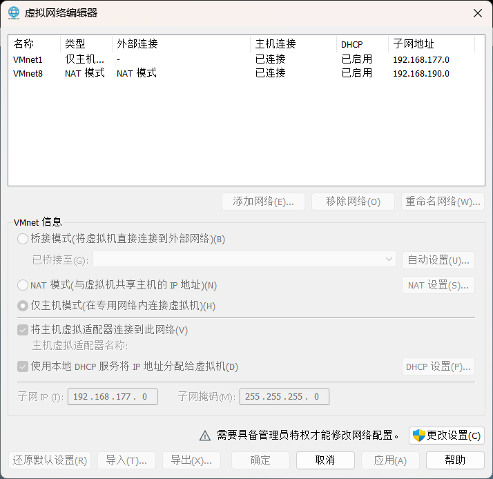
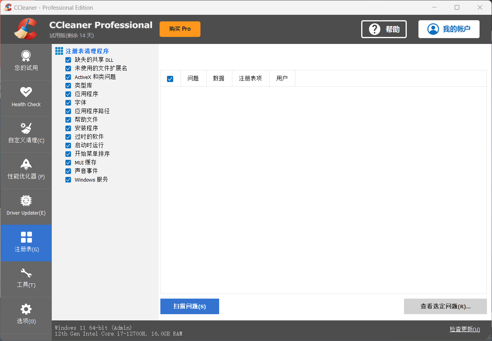
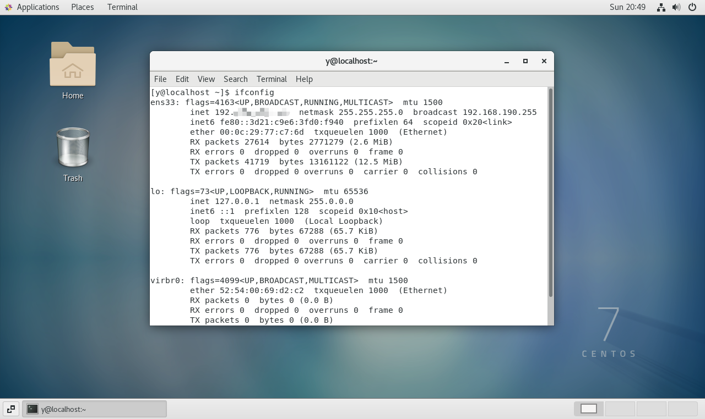

关于我弄了一个傍晚加一个上午的连接这件事
<!-- more -->
没截图（出问题的时候没想着截图，有缘再，算了这种缘分无福消受），写个大概，问题发生的背景是我的vmware卸载过。
在final shell连接的时候显示连接超时，找了教程去修改了虚拟网络编辑器，在更改wmnet8的时候修改了很多次，每次配置更改的小窗显示特别久但是一直没能成功把主机虚拟适配器那个勾选上。

后来去搜了一下是因为上一次卸载没卸载干净，所以去下载了ccleaner。把上一次的注册表删完了，顺手还删了一些其他的被检测出来的注册表，我选择了先备个份怕删错。（这个我是直接网上搜的ccleaner官网下的试用装）

到这里大概就可以尝试去虚拟机 ifconfig 找ip了（后续就是我的冤种路线，如果不行可以尝试在网络配置那里恢复默认设置，说不定是之前的影响）。
当时我直接冲进来把vmnet8给改了，惯性了属于是。
导致我的虚拟机在更改后显示 activation of network connection failed。
尝试去打开/etc/sysconfig/network-scripts/，然后vim进入ifcfg-ens33，显示这个文件名错误，整个编辑界面是空白的，出问题哩。
折腾很久想起来去把网络编辑器还原了默认配置，然后重新config发现正常了，就按照连接final shell的方法，重新连接了一下成功了。
