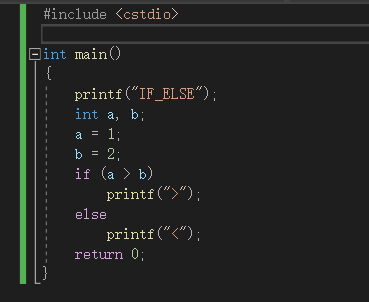
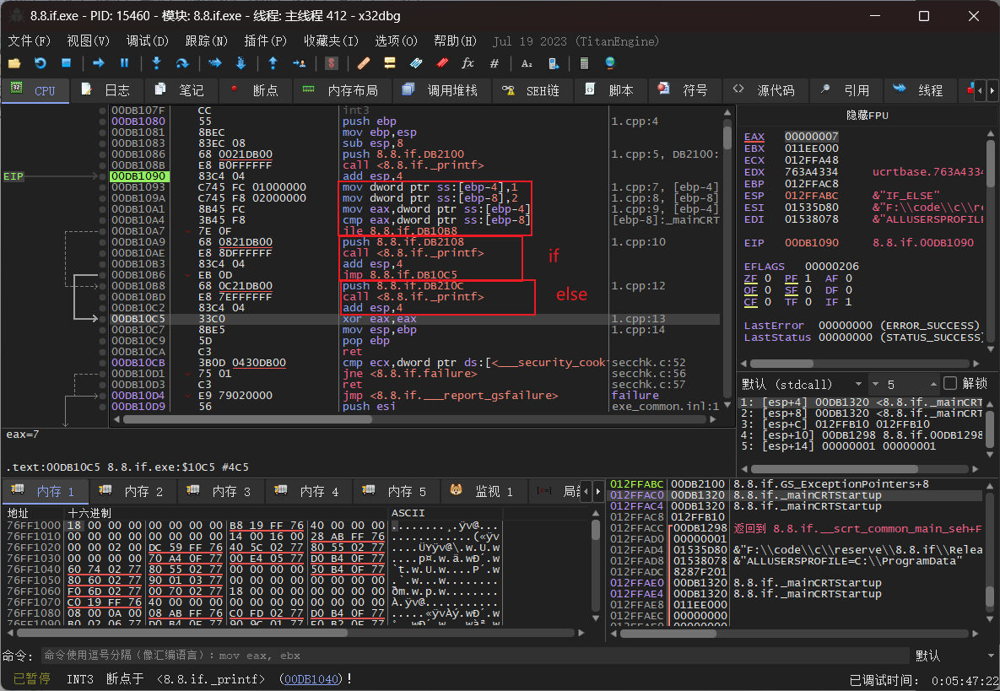
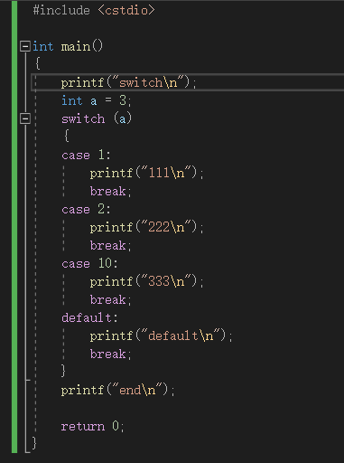
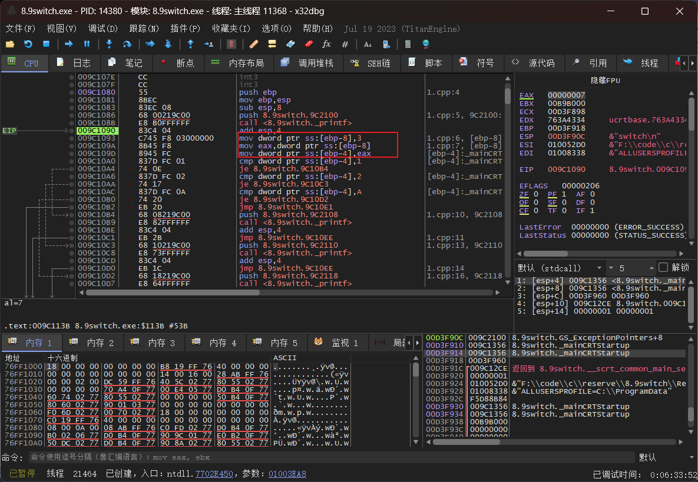
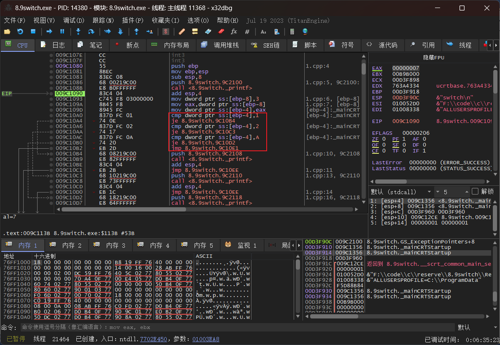
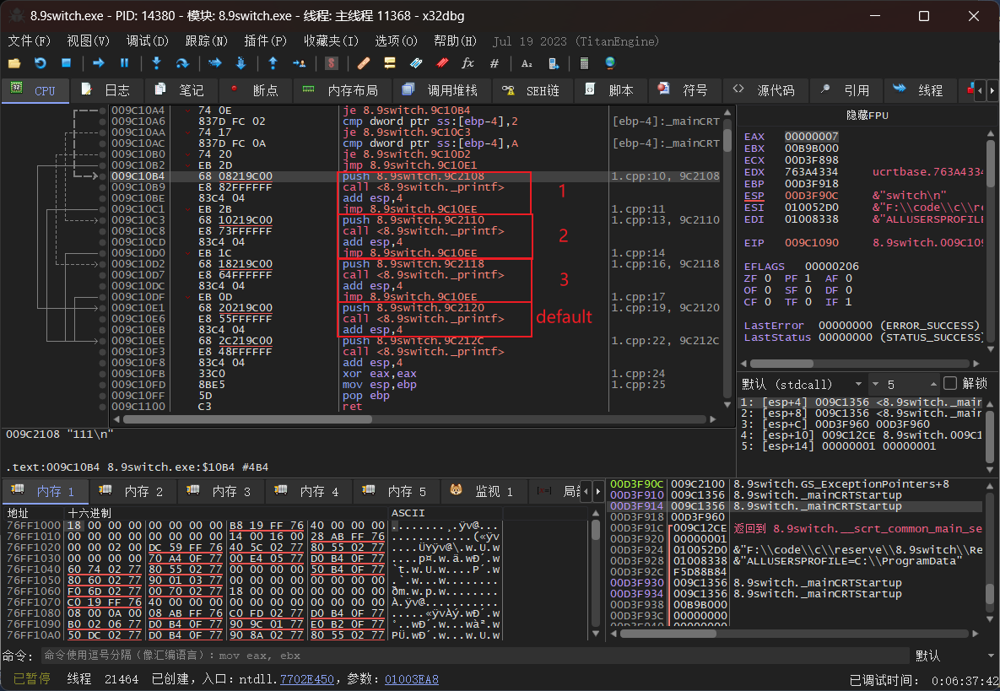
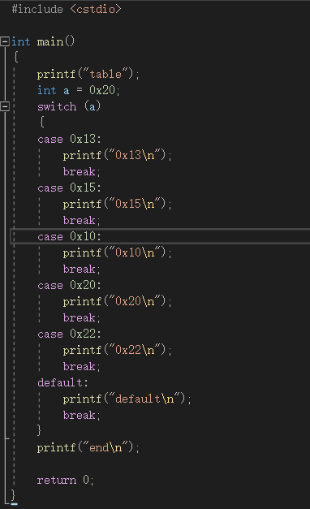
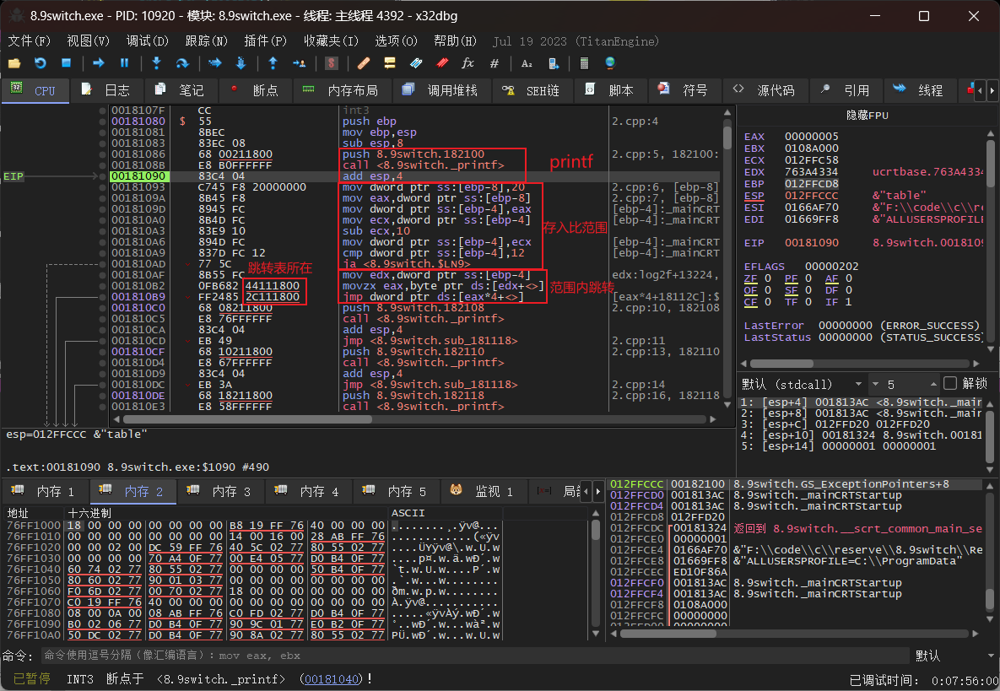
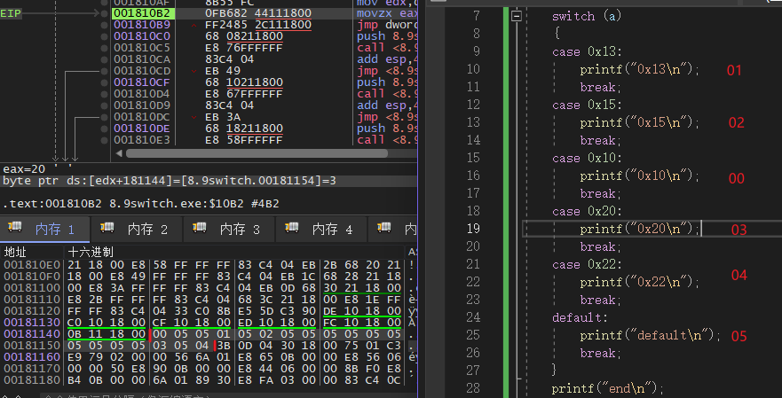
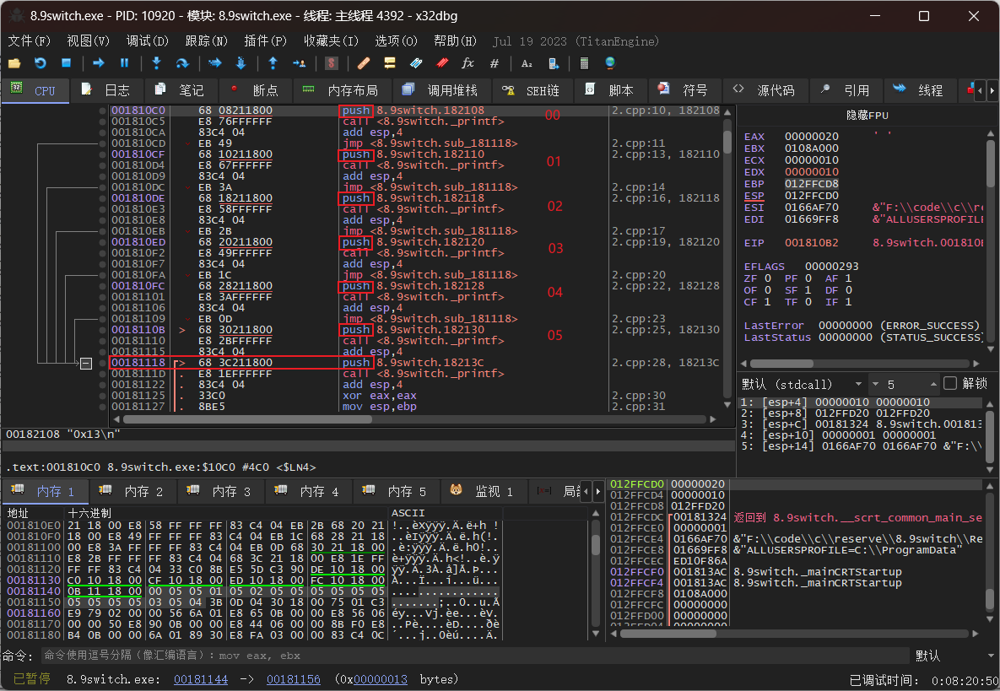

if-else & switch 汇编代码
<!-- more -->
### if-else
if语句，通过判断条件是否成立来决定是否执行后续语句，在汇编中想要不执行语句所用到的功能也就是跳转。执行if的具体的跳转指令还需要根据if的判断条件来看。

上面的代码判断条件为 a > b ，那么小于或者等于就会跳转到else执行，用到的指令也就是jle（jmp if less than or equal）。

如上图，第一个框是将a，b写入的过程，末尾的判断就是是否跳转到else。
在第二个框内无条件跳转指令则是为了不执行else直接跳转到if-else以外。
### switch
switch总体上跟if-else的逻辑一致，不过条件选择多了，变得稍显复杂。

下图为写入a的值，方便进行后续比较。虽然只需要一个四字节的寄存器位置存放就可以比较，但在此过程前中esp会多一个四字节位置作为中间变量的位置。

这里是三个比较条件和default（最后一个无条件是default），通过跳转执行该条件下的语句。

这里是四种情况的执行语句，除了最末尾的default，每个后面都有一个无条件跳转出switch的语句，这样的跳转是因为程序中的break，如果没有break，这里也会从某一板块开始执行完所以条件对应的语句。

接下来是关于switch跳转表,已知只有条件比较多才会使用到跳转表。

下图中printf下面的框内是存入判断相关的数据并且比较的过程。这里的比较，指的是在条件中最大和最小条件的差值和输入的参数与最小条件的大小差值的比较。在第5排的`sub ecx, 10`就是输入参数和最小条件的差值（这样通过差值来找也就相当于是偏移，第一个条件的偏移也就是0），倒数第二排的12就是最大和最小条件的差值。
当输入参数的差值超过12时不可能是已经给出的条件的任意一条，所以直接执行ja跳转到defualt，这样可以省很多事。当差值不超过时就可以根据差值在跳转表来找具体执行的时哪一部分。
往下一个框内,第一行是确定当前的差值；第二行是找到跳转表，而机器码中的44111800就是跳转表地址，按照存储顺序为181144（下一张图中执行到了这一句话可以在汇编代码和内存之间的框里面看见）；第三行则是跳转执行该条件下的语句。

如下图，这里可以看见在内存部分标出的内容就是跳转表的内容，条件的排序是按照其case后跟的大小来重新排序后使用的，而最大到自小的条件的内存距离为19，跳转表大小也为19.在跳转表中按照顺序（相减后差值大小，也可以理解为偏移）该位置有case规定的则为是哪一个case（例如：00，01，02），没有的则跳转default（05）.以此来完成switch语句的功能。

下图就是对应的在`jmp dword ptr ds:[eax*4+<>]`后的执行内容刚好4字节就是每个条件需要的大小，其余的调用再通过四字节内的call来实现，每个后面的jmp同样是break的作用。

