关于ebp，esp，函数调用约定
<!-- more -->
### esp & ebp
esp，栈指针寄存器，指向栈顶。ebp基址指针寄存器，指向最靠近0地址的栈的底部。
栈顶和最靠近0地址的栈其实是变化的，ebp和esp也是变化的。在调用函数时会开辟新的栈空间用于储存中间产生的数据，在函数调用结束后销毁。同时通过一些方法保证call完成后esp和ebp的值恢复原状。（在执行call的时候也会自行保存eip在ebp保存之前）
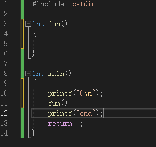
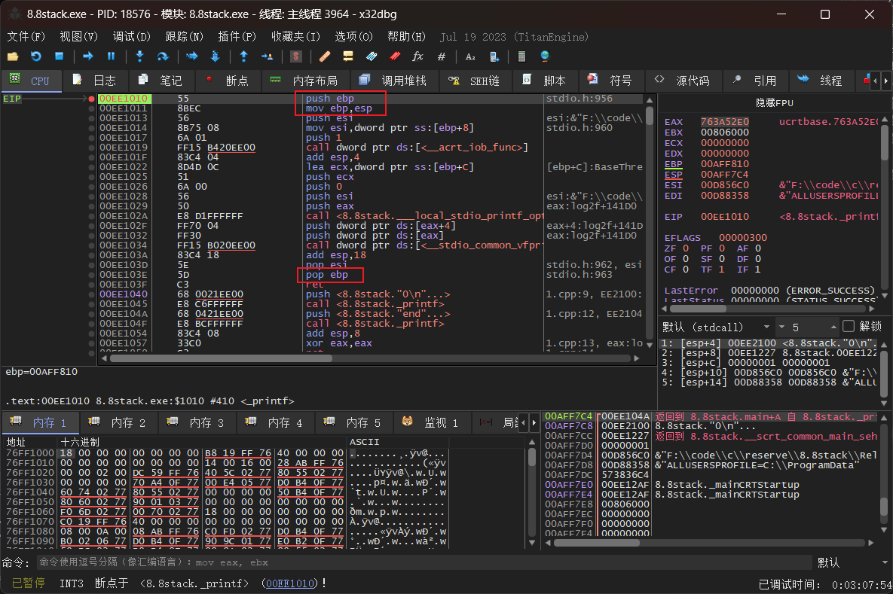
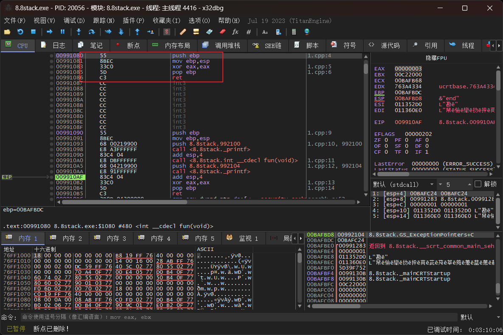
在函数调用一开始会先储存当前的ebp，并且在最后出栈还原。而在压栈ebp后紧接着将esp的值赋给ebp，这样ebp就指向了上一个栈没存数据的边缘，开辟了新的栈段用于这个被调用的函数。(大概画了下)
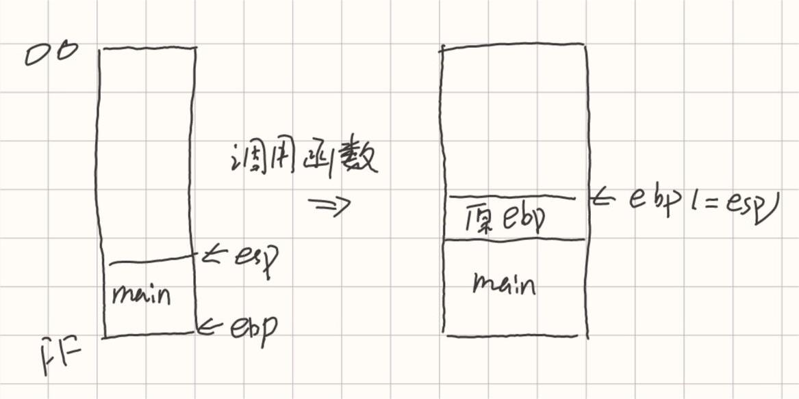
### cdecl
__cdecl 调用时括号内的参数从右到左入栈，这些参数由调用者清除（手动清栈）。此为c，VC++默认约定，可以在开发环境中修改设置默认，如果带有可变参数的函数必须使用此约定，如printf，scanf。
手动清栈，即清栈的代码在调用函数处，不在被调用函数内。清栈的方式则是将栈的栈顶指针esp往回挪（add指令），之后的再次存储会直接覆盖掉前面存储的参数。
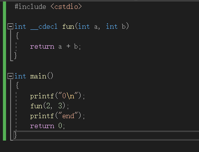
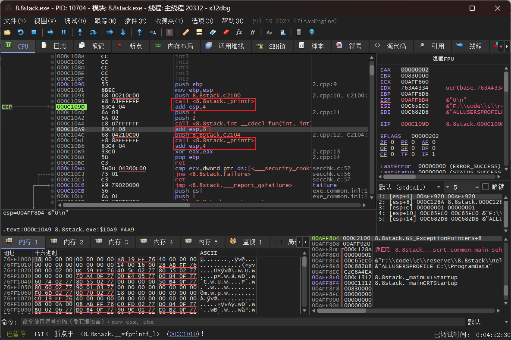
### stdcall
API函数调用约定，是c++的标准调用方式，参数从右到左入栈，如果是调用类成员最最后一个入栈this指针。
参数由被调用函数在返回后清楚，使用的指令是return x，x标识参数占用的字节数（内存空间大小），CPU据此在ret后自动弹出栈的空间，称为自动清栈。
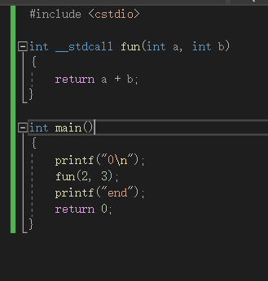
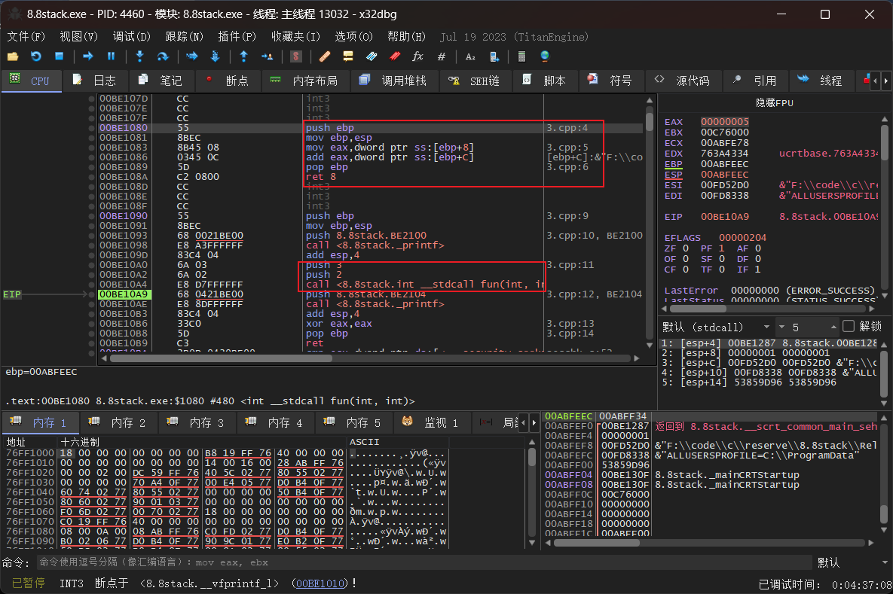
### fastcall
__fastcall 编译器指定的快速调用方式，其规定将前两个（或几个）参数由寄存器传递（mov指令），其余用堆栈传递，不同的编译器对几个的规定不同。如果调用过多就需要自行平衡，但也是用ret来标记需要清空的栈的空间大小。
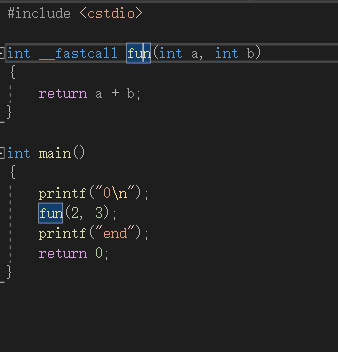
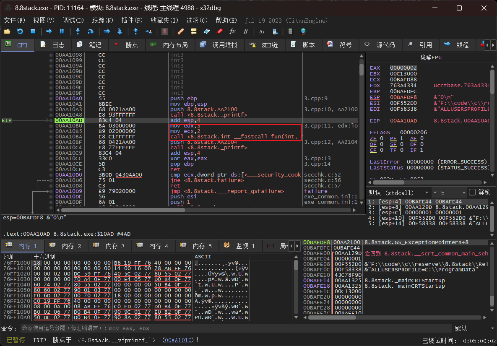
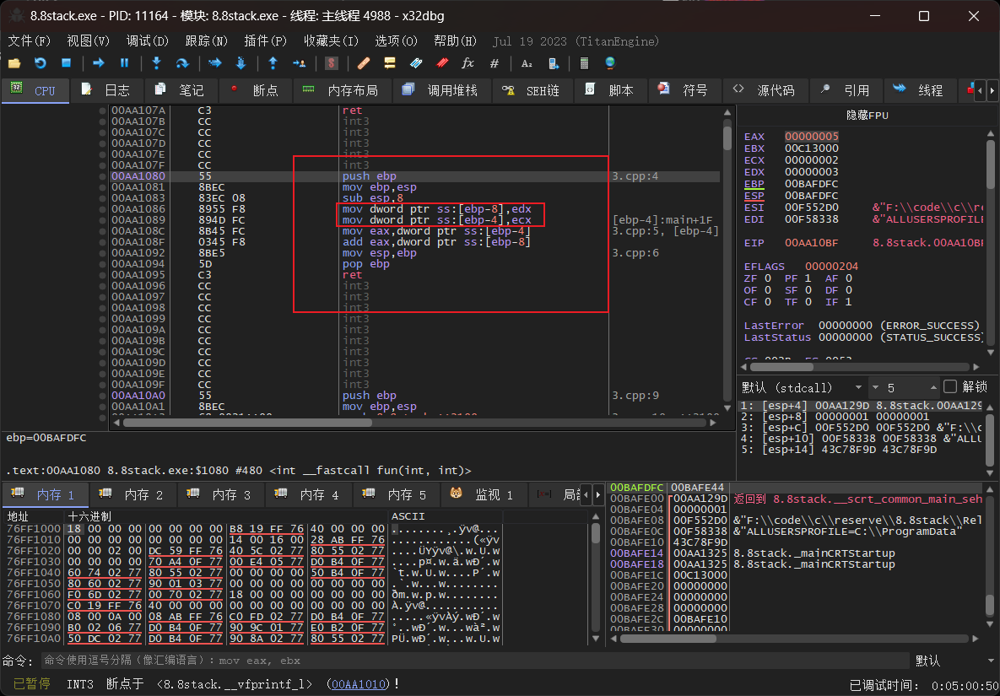

