串相关
<!-- more -->
### strcmp
strcmp的作用就是两个串之间的比较，如下为编写的源代码
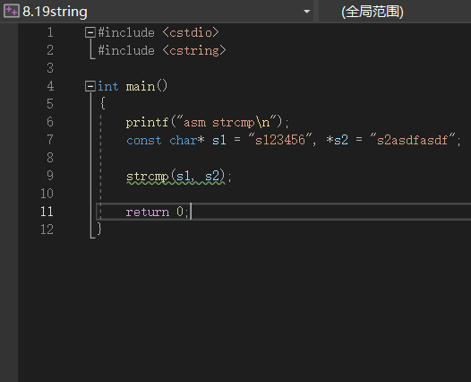
如下为主函数
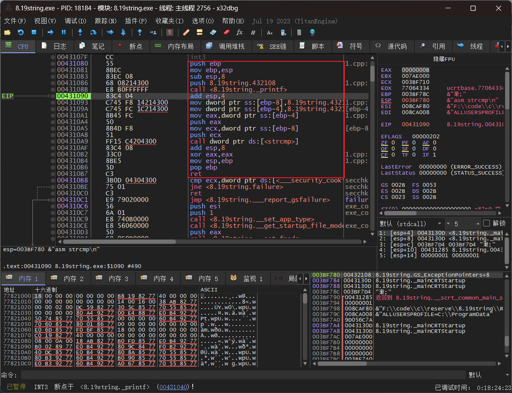
其中可以看见在未执行strcmp的时候往栈中存入了两个串的地址，同时又转换存入寄存器方便调用
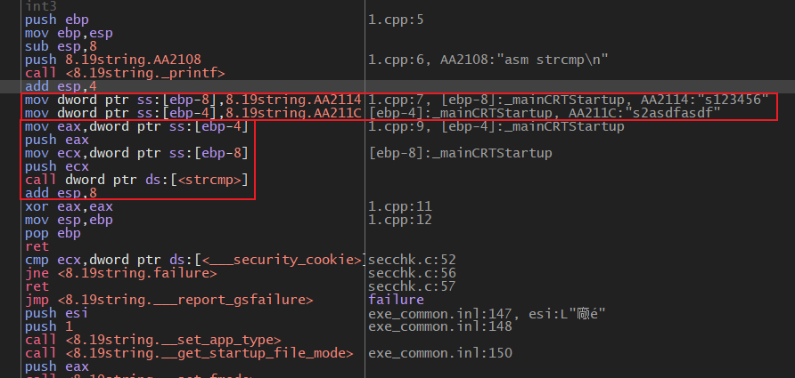
如下为strcmp函数部分
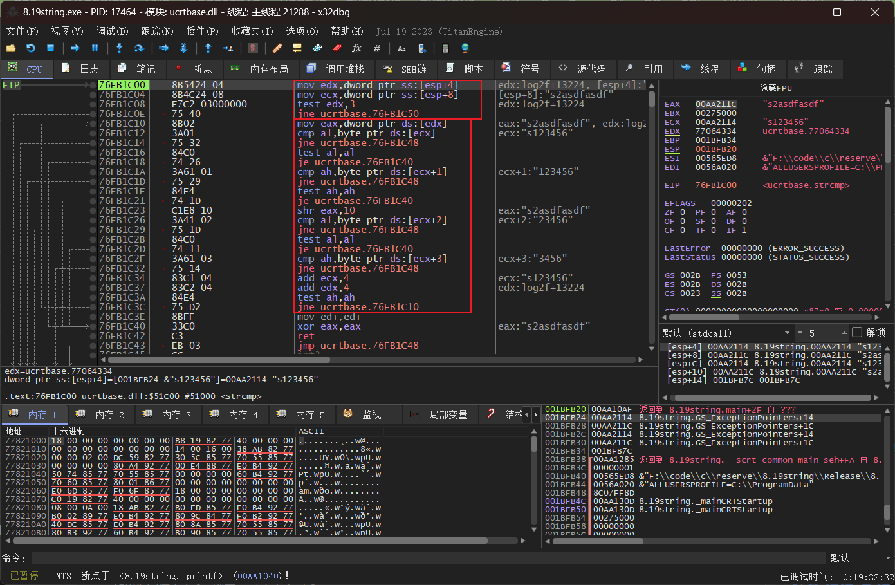
首先是取出地址部分然后检测地址是否为空，后续是进行的循环：首先`test al, al`来判断al是否为空，也就是是否为串的结束部分，不为空继续往后比较大小(`shr eax, 10`)，大小一样继续比较后面，不一样则跳转执行具体的大小比较(`jne ucrtbase.76FB1C48`)。循环也就是靠`jne ucrtbase.76FB1C10`做到，这里的地址就是我们在确定地址不为空的`test edx, 3`后一句的后一句的地址。
这里的test指令其实是将两个内容进行逻辑与的过程类似于and但是不改变两个地方的实际值，只改变寄存器。
### scas & repne
scasb，scasw，scasd其实也就是对应的byte，word，dword。scasb编译后相当于cmp byte ptr [edi],al 对标志位有影响还会修改寄存器edi的值（df = 0，inc edi；df = 1，dec edi）。
代码如下,略显粗暴
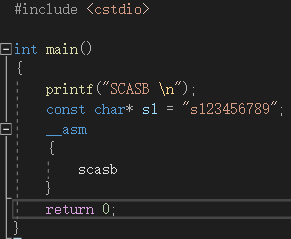
未执行到scasb时
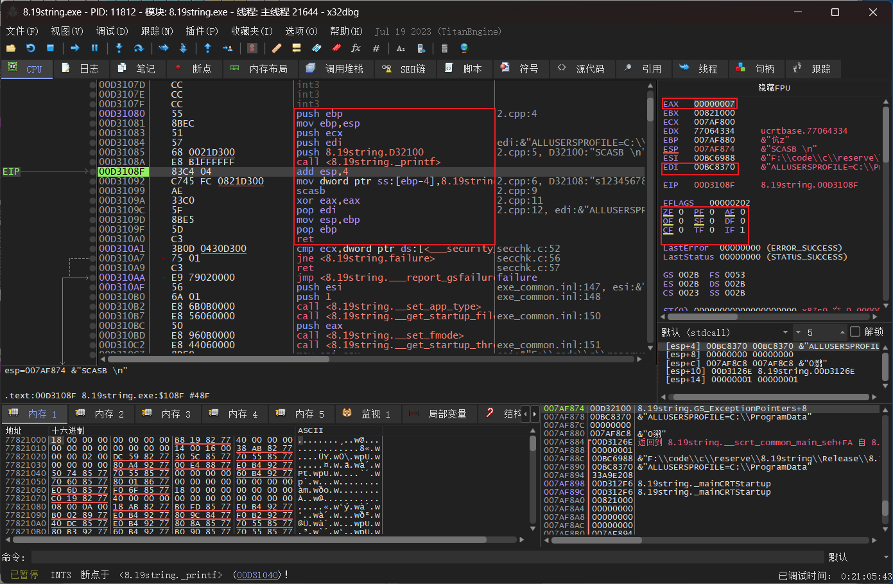
执行过scasb，edi因为df为0，inc edi
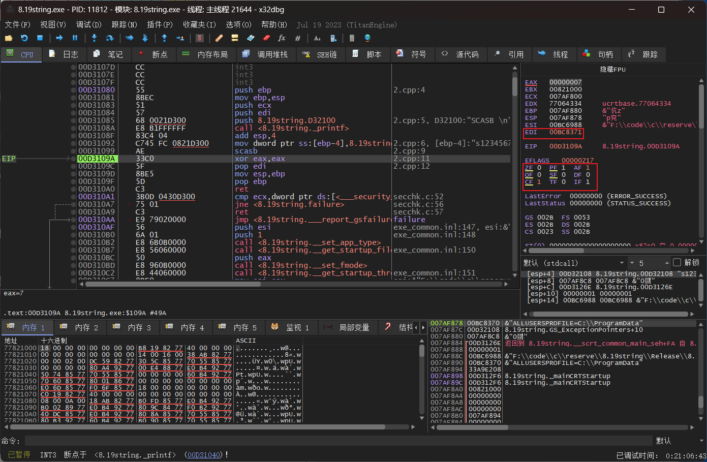
repne或者repnz都是一个意思，满足ecx != 0且 zf = 0时重复执行其后跟着的指令并将ecx减一（根据b，w，d转换地址），比如repne scasb 重复执行scasb。
稍微修改代码，主要是计数这个串的长度
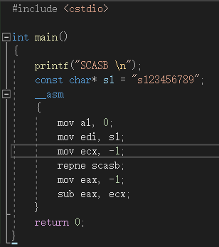
刚开始时
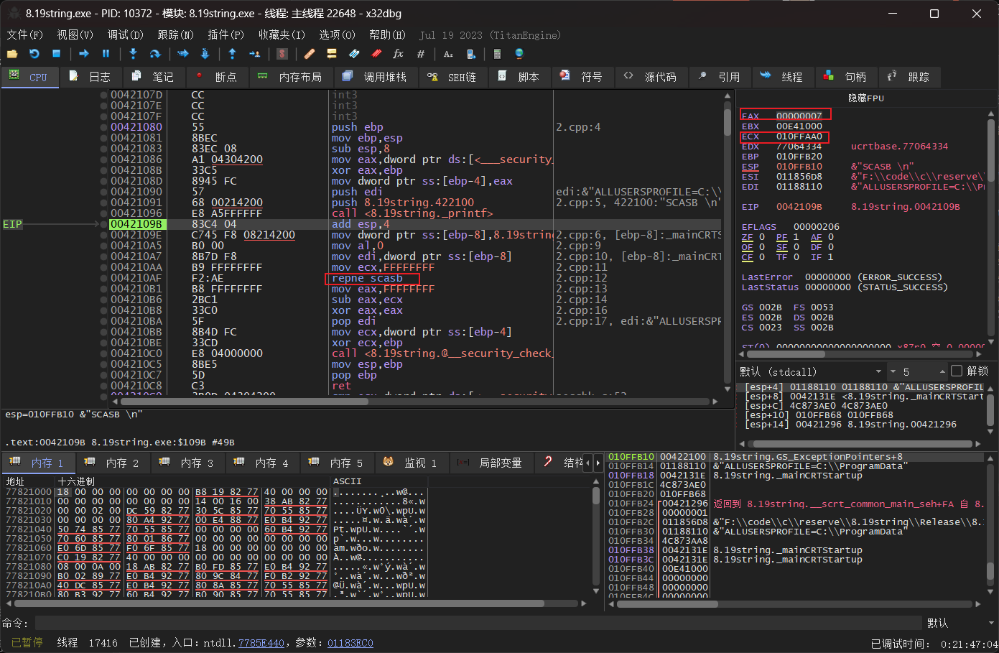
赋值ecx，al后
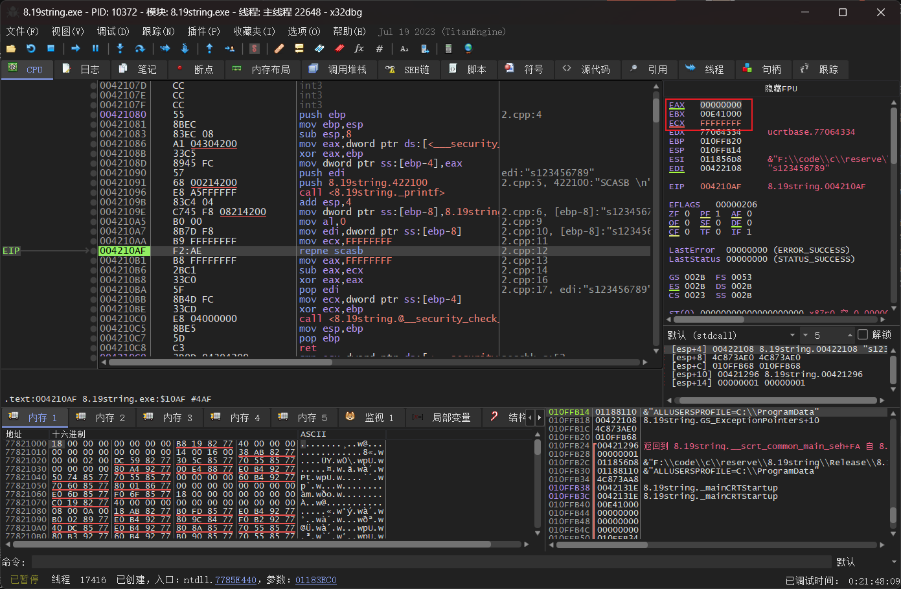
每次执行scasb导致的edi增加也就是提取的串的字符往后移的过程，移到串的结束符的时候于al的值相同了，zf赋值为1，edi回移；repne不知继续循环。此时的ecx与一开始的差值再减一（结束符的长度）就是串的长度。
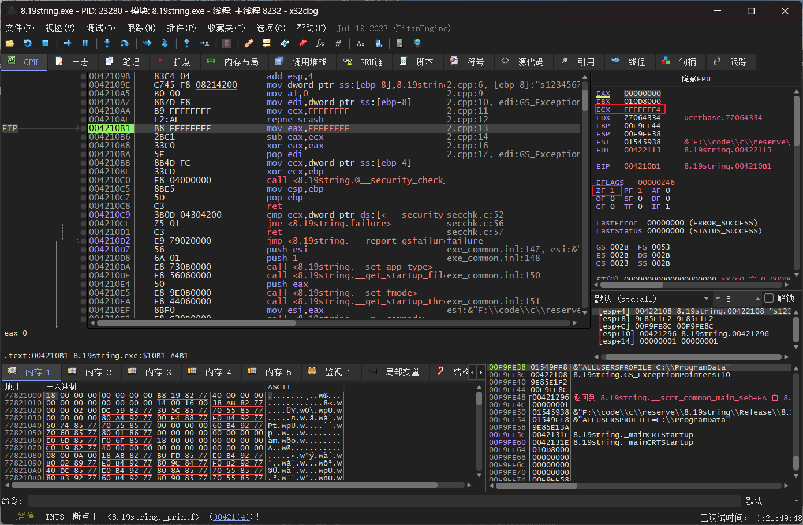
再改进一下代码增加减一的部分，注释掉的和写出的都可行
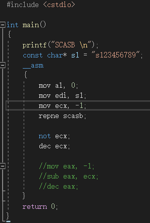
### cmps
相较于scasb，cmpsb的区别就在于比较的是两个串scasb是寄存器和串的比较。同样有cmpsb，cmpsw，cmpsd。
代码如下，cmpsb同样可以与repne连用作为循环
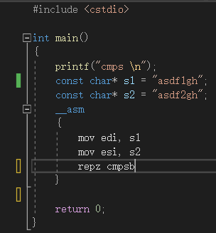
刚开始
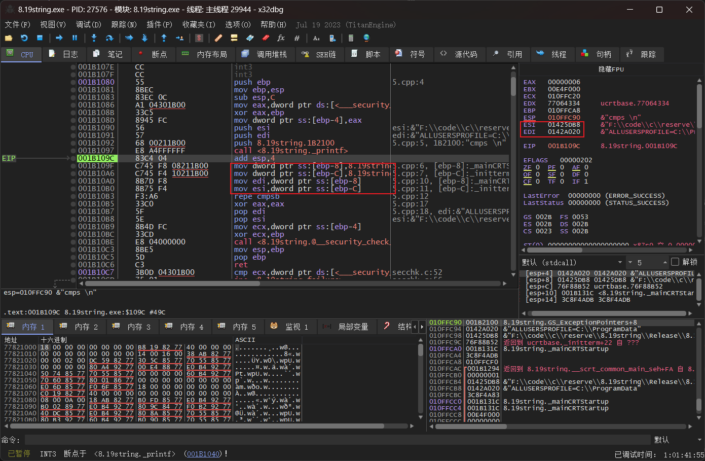
将两串赋值给esi和edi寄存器
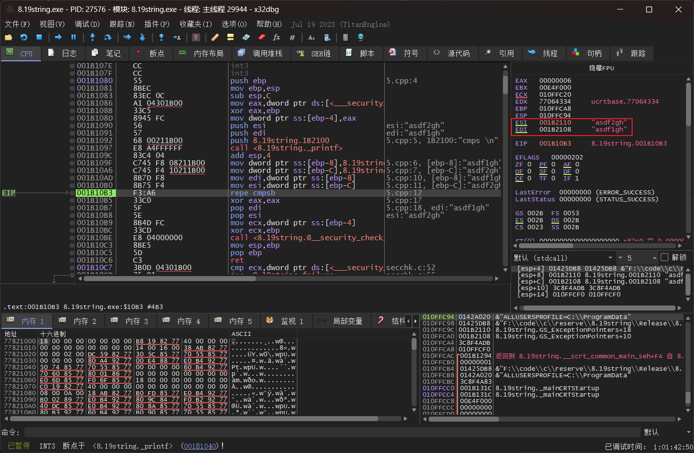
两个串只有2和1的差距，在检测到这个地方后大小就比出来了然后跳出repne继续执行下一条指令
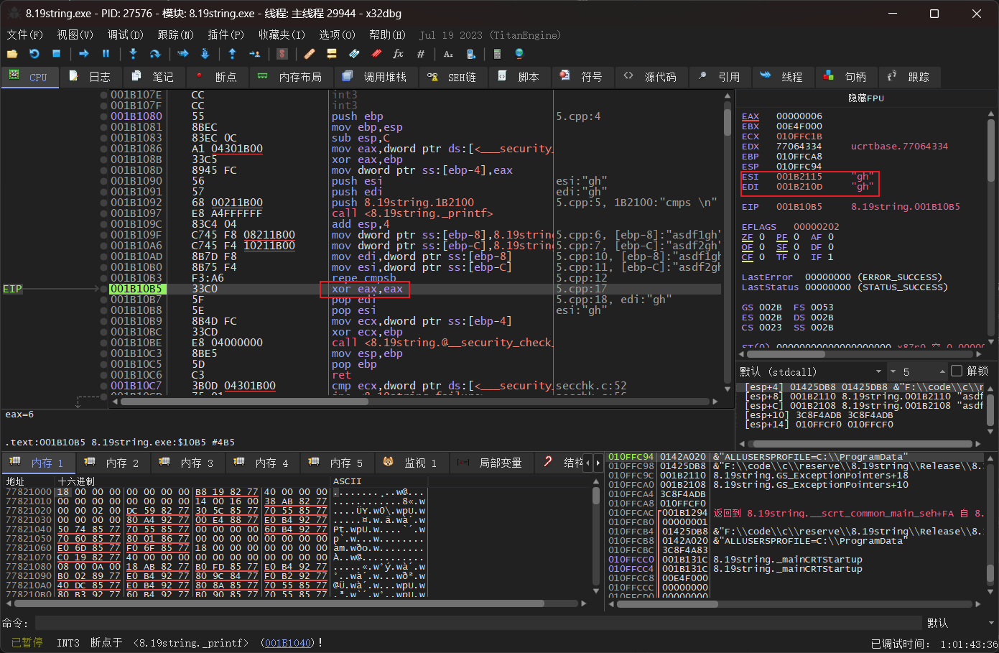
用cmpsb来写一个strcmp函数
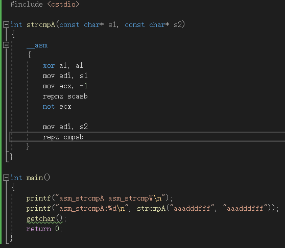
以下是主函数
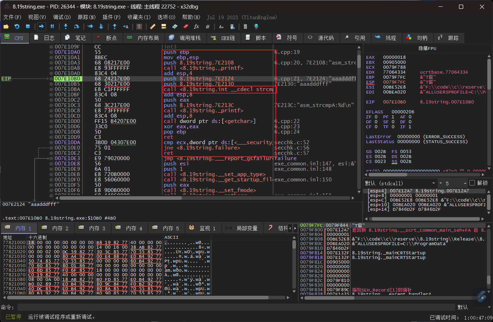
跳转到call strcmp的位置，这里多了一些我在代码里面没写的东西，这是编译器直接加的，如果不想要可以在前面写`__declspec(naked)`，但是这样寄存器调用前的入栈调用后的出栈还原，堆栈的平衡都要自己写了。
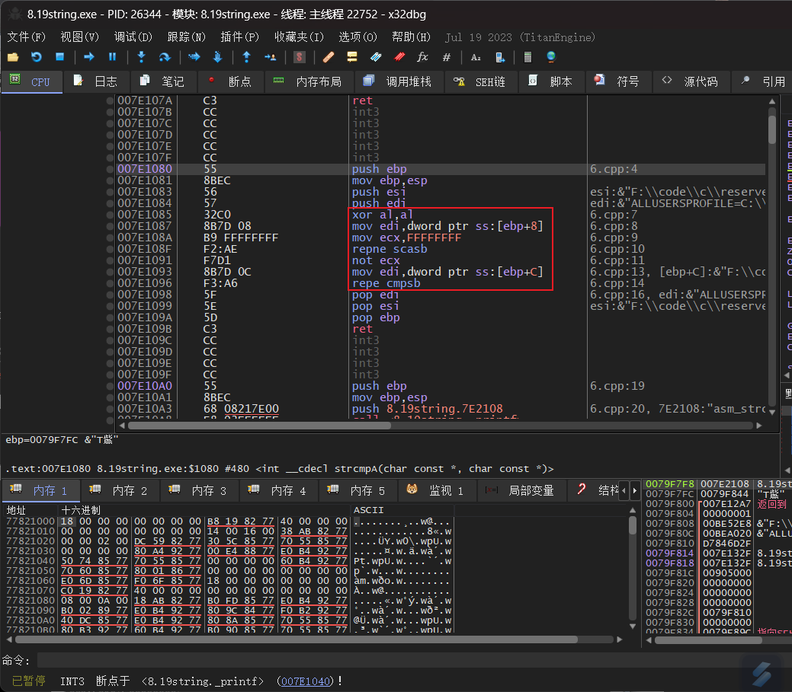
