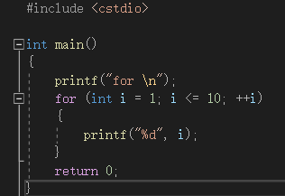
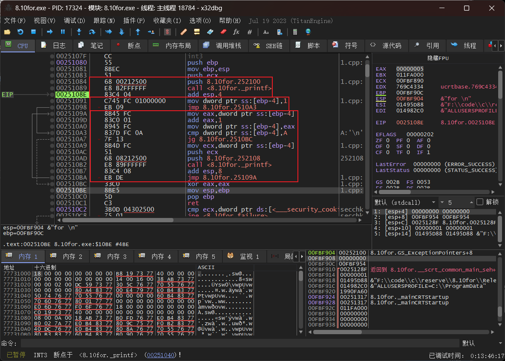
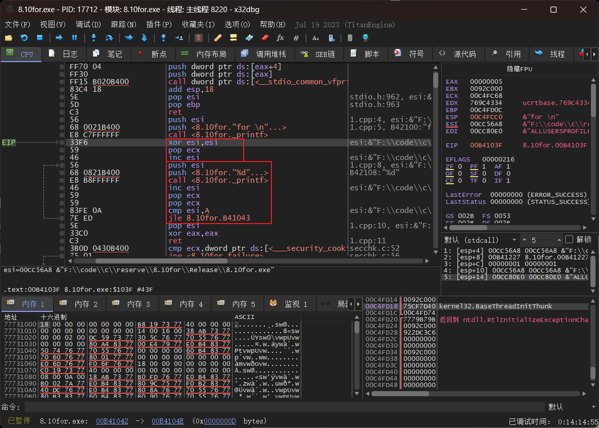
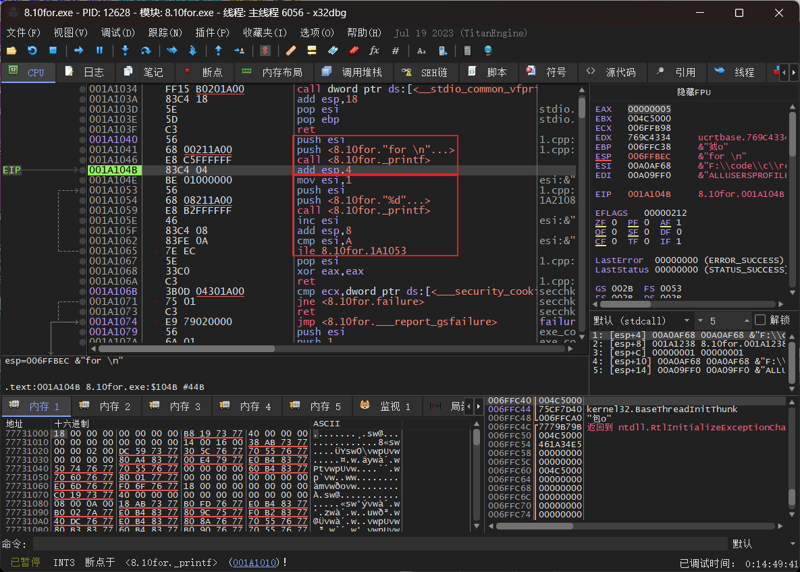
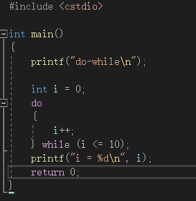
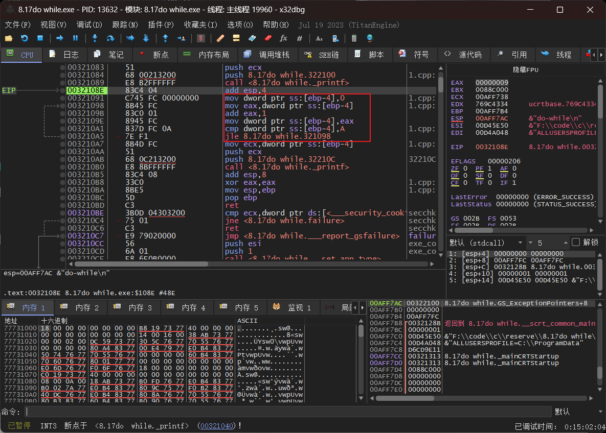
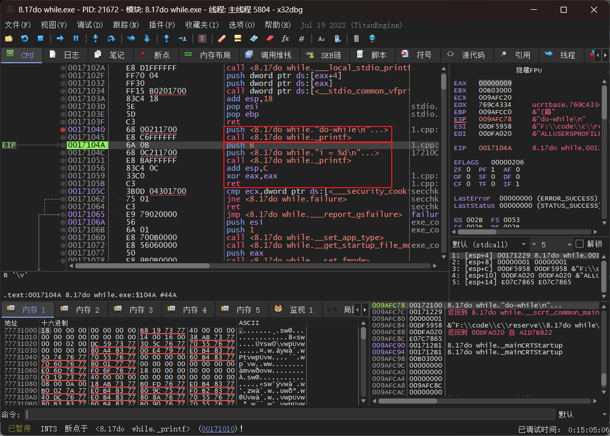
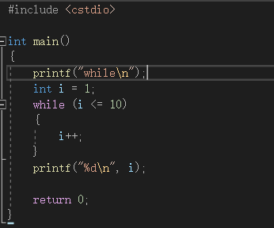
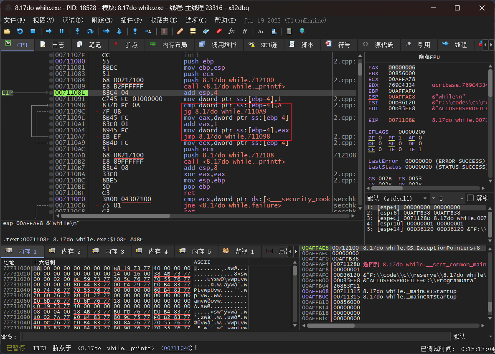
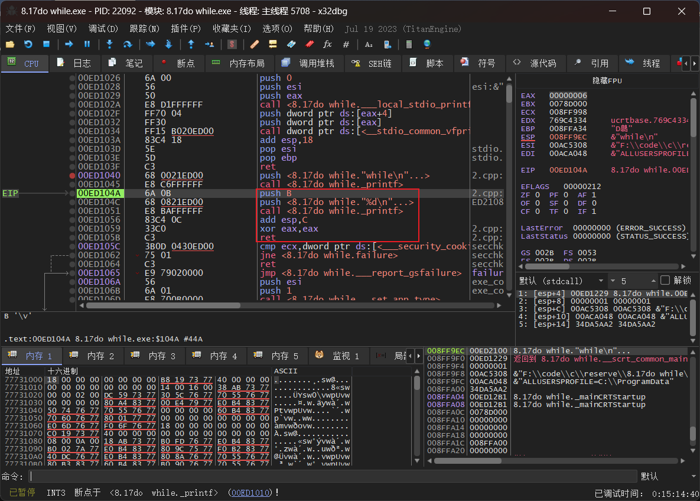

for & do-while & while 的编译器优化和未优化版本
<!-- more -->
### for
代码如下

无优化版本如下

上图第一个框是第一个printf，第二个框是初始化i=1，往下是循环的过程，因为初始化在循环外所以循环内是先比较大小再++i。
下图是优先大小优化

上图肉眼可见的汇编代码变少了，用过程中寄存器和inc能减少程序的大小也可以减少程序的运行时间
下图是速度优先的优化，主要是printf的执行过程的区别，优化内存选择了多次出入栈，减少其他内存的申请，优化速度则是直接调用然后改变栈顶位置。

### do-while
代码如下

未优化版本

因为判断条件在while处所以跳转指令在最后
下图为速度优化（内存优化效果相同，应该是因为代码本身简单

这里主要是因为i的初始值和while的判断以及循环的指令过于简单，所以直接由编译器得出了执行程序的结果，直接输出了结果，如果是不给i赋初值就会进行循环
### while
代码如下

未优化版本如下

优化版本如下

也是通过编译器直接计算出了循环的结果，直接将循环结果入栈再打印。