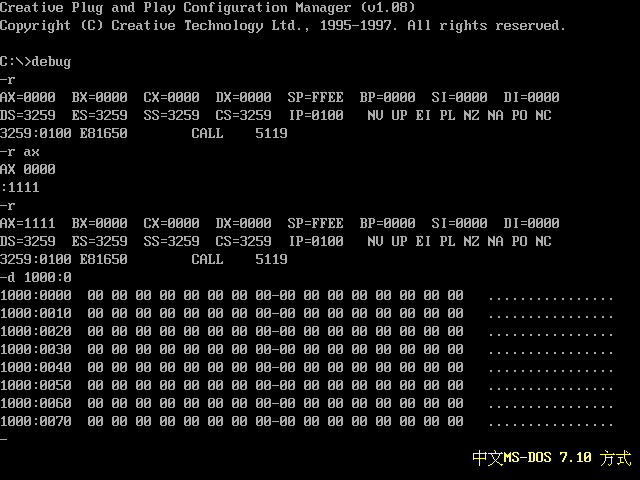
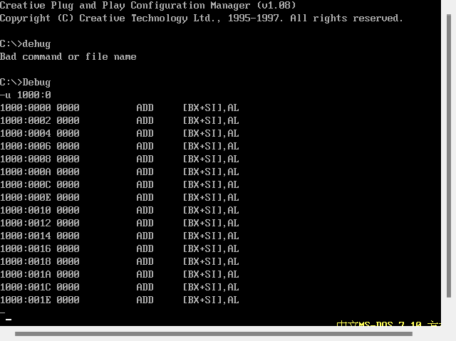
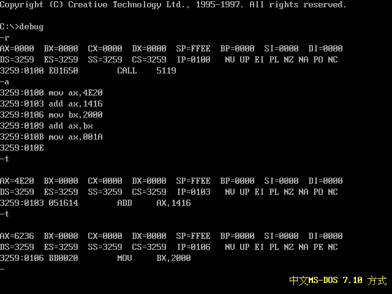
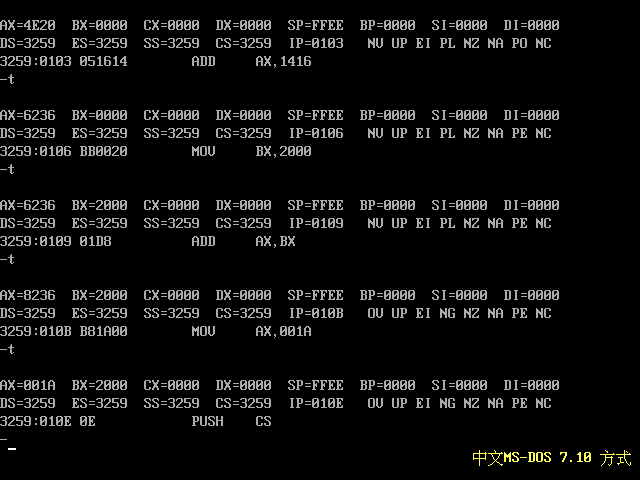
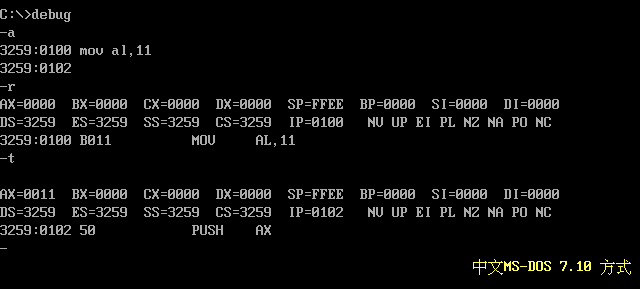

   汇编语言（第四版）1-3章自学的知识点小结
<!-- more -->
## 第一章
### CPU & 总线 &存储器
CPU作为计算机的核心部件，控制整个计算机的运作并进行运算，运算所需的指令和数据储存在存储器中。而存储器被划分为若干个存储单元，每个存储单元从0开始编号，微型存储器的存储单元为一个字节，即八个二进制位。
CPU通过接口板控制外部设备，类似于音响等。
CPU读取存储单元地址，命令，数据都需要通过总线完成。总线是一根根导线的集合，从逻辑上分为地址总线，控制总线和数据总线。8根数据总线可以传递一个二进制数据。地址总线的宽度决定了CPU的寻址能力，数据总线，控制总线以此类推。
例如，1个CPU的寻址能力为8KB，那么它的地址总线宽度为2^13（也就是13根）。
存储器从读写属性上分为随机存储器（RAM）和只读存储器（ROM）。
随机存储器可读可写，但带电储存，只读存储器只读不写。
CPU在控制存储器时均将其作为内存看待，将其总的看作一个由储存单元构成的逻辑存储器，这个逻辑存储器也就是内存地址空间，每个物理存储器在其中占有一个地址段。
## 第二章 寄存器
### 通用寄存器
一个典型的CPU由运算器，控制器，寄存器等期间构成，由总线连接。
8086CPU的所有寄存器都是16位，可以放两个字节，AX，BX，CX，DX存放一般性数据，被称为通用寄存器。
以AX为例，AX可以分为两个八位寄存器AH+AL，其中AL为低八位，AH为高八位（字一般由两个字节构成，前半为高八位）。
在汇编指令中寄存器名称不分大小写。在汇编指令中可以单独改写AH或者AL的值。
### 物理地址 & 段
每个内存单元都有唯一的地址，这个唯一的地址被称为物理地址。8086是16位结构的CPU，但是有20位地址总线，所以8086CPU采用内部结合的方式用两个16位地址合成的方法形成一个20位的物理地址。
CPU提供两个16位的地址，一个位段地址，一个位偏移地址，输送进地址加法器。物理地址=段地址*16+偏移地址。（计算方法也被称为左移四位，四位是基于数据的存储形式为二进制）（可以类比C语言的指针偏移，或者说C语言的指针偏移基于此）
段地址，其段并不是内存分段，而是由CPU划分，段地址是连续的内存单元，一个段的起始地址一定是16的倍数，其最大长度为64KB。例如给定段地址1000H,CPU的偏移地址寻址范围为10000H~1FFFFH。
段寄存器存放段地址，8086CPU有四个段寄存器：CS，DS，SS，ES。段寄存器无法直接导入数据，需要通过其他寄存器的中转达成。
### CS & IP
CS和IP指定了当前CPU要读取命令的地址，CS为代码段寄存器，IP为指令指针寄存器。执行的指令为CS的内容*16+IP的内容（IP也可以理解为读取指令时的偏移值）。
命令执行的过程为：读取地址->地址加法器->读取指令进入指令缓冲区->IP值自动增加（读取指令长度为多少IP增加多少）->执行。
8086CPU刚开始工作时CS和IP被设置为CS=FFFFH，IP=0000H。
mov指令不能修改CS,IP的值，可以使用jmp指令进行修改，即：1）jmp 段地址:偏移地址 2）jmp 某一合法寄存器（用寄存器中的值修改IP）。
当我们需要将一组内存定义为一个代码段时，要将CS:IP指向所定义的代码段的第一条指令的首地址。
### 实验1
因为win11不支持debug所以需要我安装一个MS-DOS的虚拟机进行实验。
Debug的功能R（查看，改变CPU寄存器内容），D（查看内存内容），E（改写内存内容），U（机器指令翻译为汇编指令），T（执行一条机器指令），A（以汇编指令格式在内存写入一条机器指令）等。
下图为r，d演示（d的格式为：d 段地址:起始偏移地址 中止地址）
 
下图为u演示

下图为a，t演示

## 第三章 寄存器（内存访问）
### 字
16位寄存器来存储一个字，高八位放高字节，低八位低字节遂需要两个连续地址，这两个连续地址构成的内存单元也称为字单元。某一地址的字单元存放的字节型数据为该地址及下一地址构成的连续地址的数据。
16根数据线可以一次性传输16位数据，字节型数据的传送可以在mov指令中给出一个16位的寄存器。也可以给一个8位的寄存器，改变某一地址，改变某一个字的高字节或低字节。
下图给出改变ax低字节的示例

### mov & add & sub
mov，可以理解为复制粘贴数据到存储空间，mov ax，bx即为复制bx粘贴到ax。
add，为加法，add ax，bx即为把bx的值加到ax上。
sub，为减法，sub ax，bx即为在ax上减去bx。
mov可以直接将数据放入寄存器，也可以让各个寄存器，内存单元互相放数据，但是不能将数据直接放入段寄存器。mov ax,[0]这个0默认为相对于ds寄存器的偏移地址。
### 栈
栈是一种规划了长度的有特殊访问方式的存储空间，将一段内存定义为一个段作为栈段，其具有先进后出的特殊模式。栈的操作以字为单位，需要借助SS段寄存器和SP寄存器来完成，SS存放栈顶的段地址(最小地址)，SP存放偏移地址。以此来达到指向栈内有元素的最高位的效果。同样地址计算为SS*16+SP。
栈最基本的两个指令为出栈pop和入栈push，两个命令后面可以接寄存器，段寄存器或者内存单元(也就是类 pop [0])，push ax：SP=SP-2 -> 将ax内容存入此时SS:SP指向的内存单元，pop ax：将SS:SP指向的内容存入ax -> SP=SP+2。
在进行操作时，被pop或者push的地址总是SS:SP所指向的地址，所以pop和push对SP的改变先后不同，且是自动改变SP内容。同时由于只修改SP，所以栈顶的最大变化范围为0——FFFFH。
pop出栈其实也是一个类似于mov的效果，pop被出栈的地址的数据不会改变，之后在下一次该地址被push时被覆盖。
假设栈的空间为10000H——1000FH，空栈时SS:SP会指向栈空间最高地址的下一个单元，即10010H，SS为1000H，SP为0010H。栈满是指向空间的最低地址，即10000H，SP为0000H。
由于push和pop只是起到一个地址索引没有对地址惊醒一个限制，所以会导致栈顶超界的问题。比如当SS:SP已经指向栈的最大容量后继续push，就会导致栈规划段以外的地址的数据被覆盖，或者当SS:SP指向的数据已经是空栈状态，继续pop就会pop出其他非栈内数据。
### 实验2
中断机制，即在执行完当前任务后，可以检测到CPU中或外部的某种特殊信息，并立刻对此信息进行处理。
以下在debug中演示跳过显示修改SP的命令的过程（中断源是单步执行）。

