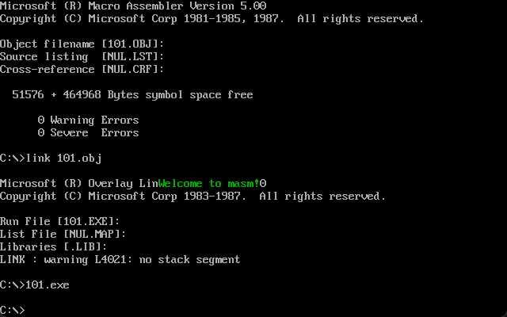
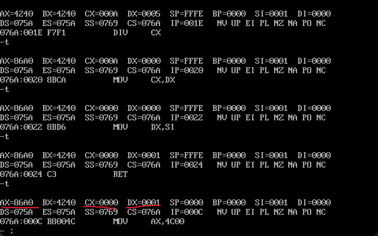
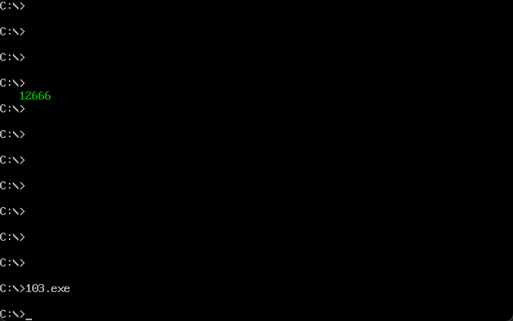
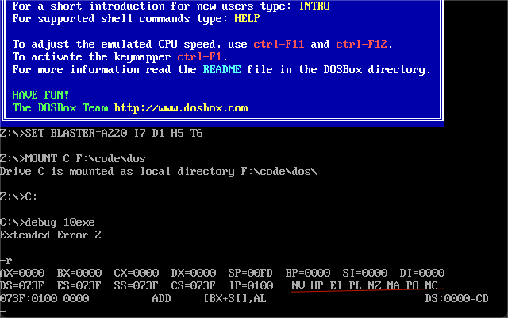
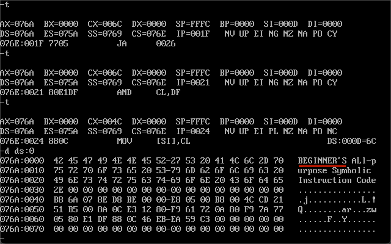
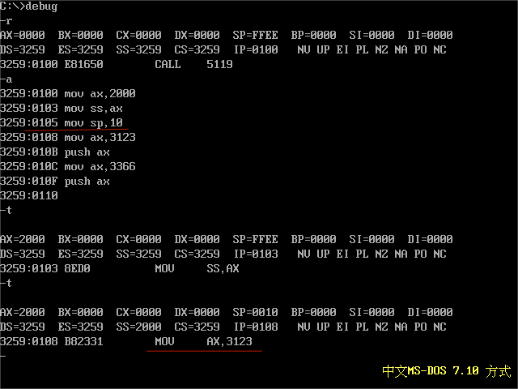
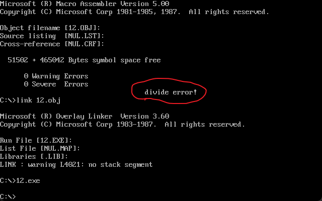
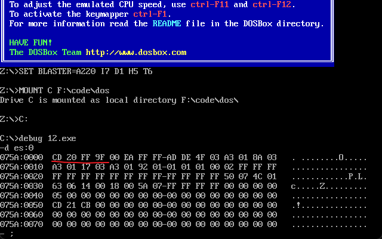
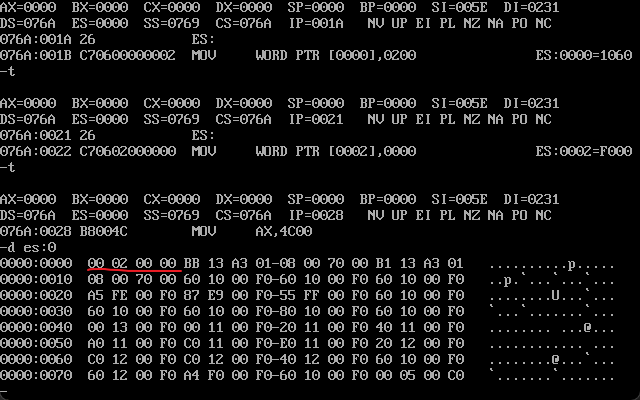

摸鱼的进度确实不太行呢
<!-- more -->
## 第10章
### ret & retf & call
ret指令可以用栈中的数据修改IP内容，retf则可以用栈中数据修改CS和IP从而实现转移。操作也就相当于令ip和cs等于栈顶元素然后再将栈顶元素出栈。
call指令也是跳转指令，先将ip或者cs和ip压入栈（先cs后ip）再转移到指定的偏移地址。而这个偏移位移=标号处的地址减去call后第一个指令的地址。也就是先把call指令放入缓存区将当前ip移到下一条指令后执行转移。
格式有：call 16位寄存器 入栈ip；call far ptr 标号 入栈cs,ip段间转移；call word ptr 内存单元地址 入栈ip；call dword ptr 内存单元地址 入栈cs，ip。
可以通过call一个标识，在标识内写入函数，并在最后通过ret返回的方式以栈作为中转来实现函数调用。
### mul
mul是乘法指令，格式为：mul reg ，两个相乘的需要是两哥位数相同的寄存器，如果是8位默认将给出的寄存器与al相乘，16位则是和ax相乘。8位的结果保存在ax中，16位低位在ax高位在dx。
### 实验10
1.显示字符串
```
assume cs:code
data segment
	db 'Welcome to masm!',0
data ends

code segment
start:  mov dh,15   ;8行太靠前了
	mov dl,25       ;3列也是
	mov cl,2        ;决定字的样式
	mov ax,data
	mov ds,ax
	mov si,0
	call show_str

	mov ax,4c00h
	int 21h

show_str:       
	push ax        ;在子函数中调用寄存器的时候为了避免寄存器冲突，全部入栈一遍
	push bx
	push cx
	push dx
	push es
	push si
	push di

	mov ax,0b800h
	mov es,ax
	
	mov al,160
	mul dh
	mov bx,ax
	mov al,2
	mul dl
	add bx,ax

	mov al,cl
	mov ch,0
	mov di,0

showc:  mov cl,ds:[si]
	jcxz ok
	mov es:[bx+di],cl
	mov es:[bx+di+1],al
	inc si
	add di,2
	jmp short showc

ok:     pop di
	pop si
	pop es
	pop dx
	pop cx
	pop bx
	pop ax
	ret
code ends
end start
```
效果如下

2.解决除法溢出，将除法分解为高低位分别计算: x/n=int(高位/n)*65536+(rem(高位/n*65536)+低位)/n
```
assume cs:codesg

codesg segment
start:  mov ax,4240h
	mov dx,00fh
	mov cx,0ah
	call divdw

	mov ax,4c00h
	int 21h

divdw:  mov bx,ax
	mov ax,dx
	mov dx,0
	div cx      ;高位部分的除法，商本来就在高位存放，余数在低位继续除法
	mov si,ax   ;ax存储商dx存储余数

	mov ax,bx   ;重新把低位给放回ax和上一次除法储存在dx的余数作为高位完成除法
	div cx

	mov cx,dx   ;cx存放余数，dx高位，ax低位
	mov dx,si

	ret
codesg ends  
end start
```
效果如下

3.数值显示，把数据段的数据以十进制显示出来，通过除法转化为十进制，再对照ASCII码表
```
assume cs:code

data segment
db 10 dup (0)
data ends

code segment
start:  
    mov ax,12666    ;作为例子的数据
	mov bx,data         ;存放处理后数据的空间
	mov ds,bx
	mov si,0
	call dtoc           ;转化为十进制

	mov dh,8            ;显示的位置和样式
	mov dl,3
	mov cl,2
	call show_str

	mov ax,4c00h
	int 21h

dtoc:                   
    push ax             ;在开始转化前的压栈
	push bx
	push si
	push di
	mov di,0
	mov bx,10
	
ahhhh:  
    mov dx,0
	div bx
	add dx,30h
	push dx
	mov cx,ax
	inc di
	jcxz okk
	jmp short ahhhh

okk:    
    mov cx,di
okkk:	
    pop ax
	mov [si],al
	inc si
	loop okkk
	pop di
	pop si
	pop bx
	pop ax
	ret                    ;dotc结束

show_str:
	push ax
	push bx
	push cx
	push dx
	push es
	push si
	push di

	mov ax,0b800h
	mov es,ax
	
	mov al,160
	mul dh
	mov bx,ax
	mov al,2
	mul dl
	add bx,ax

	mov al,cl
	mov ch,0
	mov di,0

showc:  
    mov cl,ds:[si]          ;循环来逐字移动到显示的内存区域
	jcxz ok
	mov es:[bx+di],cl
	mov es:[bx+di+1],al
	inc si
	add di,2
	jmp short showc

ok:    
    pop di
	pop si
	pop es
	pop dx
	pop cx
	pop bx
	pop ax
	ret
	
code ends
end start
```
效果图如下,显示区貌似是直接覆盖的所以多刷了一些回车变成空白页好看一点

课程设计1的内容主要参考的网上的代码，在自己写的时候反而不停的发现实验七的代码有问题，所以干脆换成了网上看见的另一个结构或者说思路的数据整理顺序，这里就不贴了。

## 第11章
### 标志寄存器
标志寄存器用于储存某些指令的执行结果，控制CPU的相关工作方式，按位起作用比如8086CPU的flag寄存器从0到15位中，1，3，5，12，13，14，15均没有作用其他有内容的标志位分别是cf，pf，af，zf，sf，df，of，在debug中有体现
zf，零标志位，执行相关指令后结果为0则该标志位内容为1.debug中zr为1，nz为0.
pf，奇偶标志位，执行后储存结果的寄存器bit位中1的个数位偶数则为1.debug中pe为1，po为0.
sf，符号标志位，执行后结果为负则为1.debug中ng为1，pl为0.
cf，进位符号位，无符号运算时向更高位进位或者借位的值则为1.debug中cy为1，nc为0.
of，溢出标志位，有符号运算时超出机器表达范围就将产生溢出。debug中ov为1，nv为0.
df，方向标志位，控制每次操作后si，di的增减，减少则为1.debug中dn为1，up为0.

### 相关指令
adc是带进位的加法指令，比如 adc ax，3也就是ax=ax+3+cf。
sbb是带借位减法指令，比如sbb ax，bx 也就是ax=ax-bx-cf。
cmp是比较指令，相当于减法，不保留结果，只影响标志寄存器的内容
转移指令，je（等于则转移，zf=1）；jne（不等于，zf=0）；jb（低于，cf=1）；jnb（不低于，cf=0）；ja（高于，cf=0且zf=0）；jna（不高于，cf=1或zf=1）.
movsb串传送命令，操作为把ds偏移si的内容给es偏移di，而后根据df的值来让si和di减小1或增加1.movsw则为增加或减少2.而同时cld可以将df设置为0，std则为1.
rep指令会根据cx的值重复执行后面的串传送指令，可以将rep和movsb一起用来转移或者说复制代码到另一个地方，类rep movsb。
pushf将标志寄存器内容压栈，poopf将标志寄存器内容出栈。
### 实验11
把以0结尾的字符串中的小写字母转变为大写字母。
```
assume cs:codesg

datasg segment
	db "Beginner's All-purpose Symbolic Instruction Code.",0
datasg ends

codesg segment
start:  mov ax,datasg
	mov ds,ax
	mov si,0
	call letterc

	mov ax,4c00h
	int 21h

letterc:push cx
	mov ch,0

  s:    mov cl,[si] 
	jcxz okk
	
	cmp cl,97    ;97和122为小写字母的范围，如果不在范围则跳转inc si进入下一个字母的循环
	jb ok
	cmp cl,122
	ja ok

	and cl,11011111b
	mov [si],cl

  ok:   inc si
	jmp short s
  
  okk:  pop cx
	ret
codesg ends
end start
```


## 第12章
### 内中断的产生和处理
中断也就是CPU在接收到信号后立即对该信号后不继续执行正在执行的程序，转而多信号进行处理，而这个信号被称为中断信息。
内中断的中断源有以下四种：除法错误（溢出等），单步执行，执行into指令，执行interesting指令。中断源发出的中断信息中必须包含识别来源的编码，终端类型码为一个字节型数据，可以表示256种中断信息的来源。而根据这个码在内存中的中断向量表找到对应的中断向量，进而通过中断向量前往中断处理程序。对于8086pc机而言中断向量表指定存放在内存地址为0的位置从0000：0000到0000：03FF的1024个单元中存放着中断向量表，但事实上没有这么多的中断向量，部分内存是闲置的。
在处理内中断信息时考虑到需要返回继续执行未执行完的代码，所以会在进入处理程序前先保存原本的cs和ip，保存处理程序需要使用的寄存器的值等再处理。完整过程为获得中断码->标志内存器入栈->将标志内存器的第8.9位的TF和IF设置为0->cs，ip先后入栈->从内存地址为中断类型码*4和中断类型码*4+2的内存地址读取中断处理程序的入口的ip和cs（*4和*4+2是因为每个类型都需要两个低位字节存ip两个高位存cs，且完全按照中断码编号分配内存）->保存用到的寄存器，处理中断，恢复寄存器，iret指令（相当于pop ip，pop cs，popf）返回
### 中断处理实例
除法错误比如溢出时会显示divide overflow作为提醒，显示后返回操作系统中，debug时也就是直接退出debug。
单步中断，就好像debug的t命令，再执行t命令时debug会将TF设置为1，再CPU执行完该指令后引发单步中断，再将tf置为0，再执行中断处理程序，所有寄存器内容会被显示在屏幕上。这个时候再回过头看一下在一般执行中断程序前的tf=0的步骤有了解释。
在响应中断处理时需要注意如果正在设置ss的数据而未设置sp将无法进行中断，因为在中断程序中需要往栈内压入内容但是如果仅设置ss，无法指向一个正确的栈顶。所以在设置ss和sp时需要紧接着设置不然无法中断。回看实验二的内容，为什么那一条指令（mov sp,10）没有显示执行过程。正是因为无法中断。

###实验12
编写0号中断的处理程序，不知道要怎么调试所以看网上的往里面塞了一段溢出的代码作为调试得到的效果。
```
assume cs:code

code segment
start:
    mov ax,cs                       ;以下到call之前都是安装部分
	mov ds,ax                       ;这里是将0号的中断处理程序复制到0：200h处
	mov si,offset do0
	mov ax,0
	mov es,ax
	mov di,200h
	mov cx,offset do0end-offset do0 ;直接通过减法得到程序的大小
	cld                             ;设置传输方向为正
	rep movsb                       

	mov ax,0                        ;将0号中断向量更改为指向本程序编写的地址
	mov es,ax
	mov word ptr es:[0*4],200h
	mov word ptr es:[0*4+2],0

	call mytest
 
    
    mov ax,4c00H
    int 21H


  do0:  jmp short do0start          ;相当于被打包的行李，通过前面的安装程序放到了内存中
	db "divide error!"              ;作为数据不好放在其他地方会被覆盖，所以一起打包了，但是没法执行所以前面jmp掉了

do0start:
    push ax                         ;在中断处理程序也需要保存备份
    push es
    push di
    push ds
    push si
    push cx

    mov ax,cs                       ;找到需要输出的字符的位置
	mov ds,ax
	mov si,202h
	
	mov ax,0b800h                   ;显示出来的步骤
	mov es,ax
	mov di,12*160+36*2

	mov cx,13

  s:
    mov al,[si]
	mov es:[di],al
	inc si
	add di,2
	loop s

    pop cx
    pop si
    pop ds
    pop di
    pop es
    pop ax

	mov ax,4c00h                    ;作为一个完整的程序需要结束语
	int 21h

mytest:          ;调试程序
    push ax
    push bx
 
    mov ax,1000H    
    mov bl,1H 
    div bl      ;产生除法溢出，触发0号中断
 
    pop bx
    pop ax
 
    ret

do0end:nop
code ends
end start
 
```
效果图如下

我想起来我可以直接看es的内容，所以把那个调试部分删除了，代码基本没变效果图如下，第一张是未变更状态，第二张是执行后


