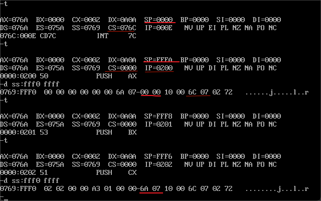
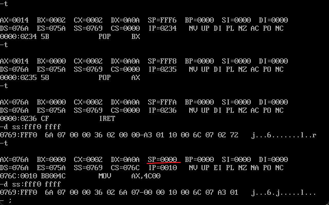
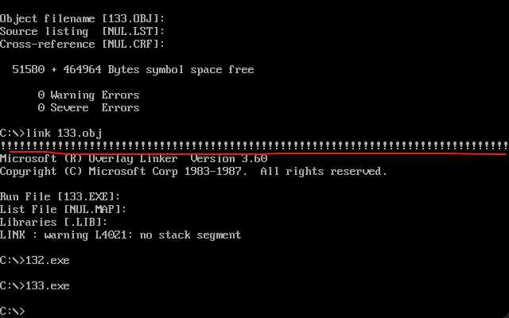
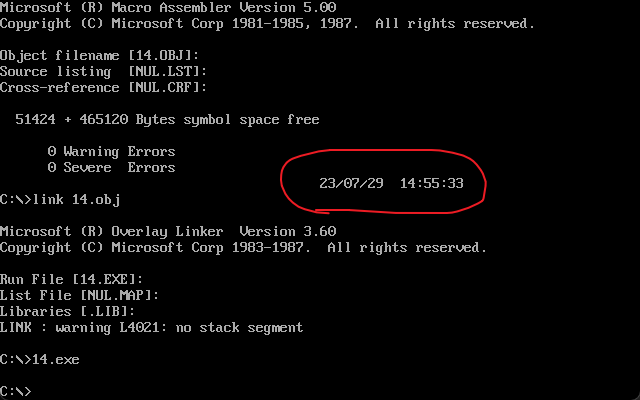
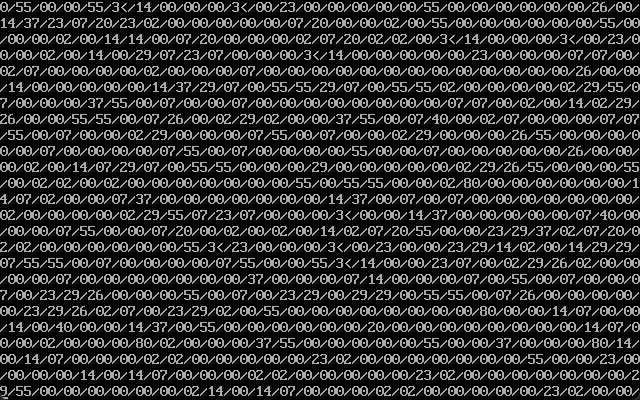
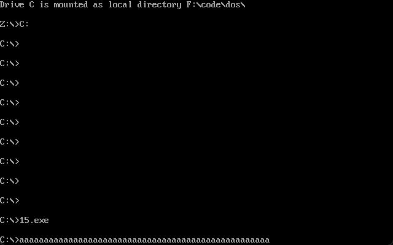

基本上都直接通过实验的代码分析来回顾。
<!-- more -->
## 第13章
### int指令
int指令也属于内中断的一种，格式为 `int n` ，其中n为中断类型码，跟前面的中断执行过程差不多，不过直接给出了中断类型码，可以任意指定进行的中断处理程序。执行过程：获取中断类型码n->标志寄存器入栈，IF=0，TF=0->CS,IP入栈->(IP)=(n*4),(CS)=(n*4+2)->执行处理程序。
### BIOS
在系统板上的BIOS（基本输入输出系统）主要提供：硬件系统的检测和初始化程序；外部中断和内部中断的中断例程；用于对硬件设备进行I/O操作的中断例程；其他和硬件系统相关的中断例程。操作系统DOS也提供中断例程。
BIOS和DOS的中断例程包含了许多子程序，这些子程序实现了程序员在编程的时候常常需要用到的功能。程序员在编程的时候可以直接用int调用其中的中断例程。
BIOS和DOS的安装过程为：开机后CPU加电，初始化（CS）=0FFFFH，（IP）=0，在FFFF：0处有一条跳转指令，执行后进行BIOS的硬件系统检测和初始化程序 -> 初始化程序建立BIOS的中断向量并将入口地址登记在中断向量表 -> 系统硬件检测和初始化完成后调用 int 91h，进行操作系统的应道，计算机交由操作系统 -> DOS启动后还会将其提供的中断例程装入内存，建立中断向量。
### 实验13
1.编写并安装 int 7ch 中断例程，功能为显示一个用0结束的字符串，中断例程安装在0：200处。
```
assume cs:code

code segment
start:
    mov ax,cs               ;将程序复制到0：200h处
	mov ds,ax   
	mov si,offset new
	mov ax,0
	mov es,ax
	mov di,200h
	mov cx,offset newend-offset new
	cld
	rep movsb

	mov ax,0                ;中断向量表
	mov es,ax
	mov word ptr es:[7ch*4],200h
	mov word ptr es:[7ch*4+2],0
    
    mov ax,4c00H
    int 21H

new:
	push ax                 ;中断程序也需要压栈
	push bx
	push cx
	push ds
	push es
	push si
	push di

	mov ax,0b800h           ;显示缓存区
	mov es,ax

	mov ax,160              ;dh为行号，160为书上一行的长度，我自己的我没算过
	mul dh
	mov di,ax

	mov ax,2                ;dl为列好，乘法算显示位置
	mul dl
	add di,ax

	mov bl,cl               ;cl为颜色

s:
	mov cl,ds:[si]          ;颜色暂存在bl，这里来判断是否为末尾的0
	mov ch,0
	jcxz ok

	mov es:[di],cl          ;低位数据
	mov es:[di+1],bl		;高位款式		
	add di,2

	inc si

	jmp short s

ok:
	pop di                  ;回复原样
	pop si
	pop es
	pop ds
	pop cx
	pop bx
	pop ax

	iret
	
newend:nop                  ;方便定位程序的长度，nop没啥实际意义

code ends
end start
```
给了个测试程序吧相当于
```
assume cs:code

data segment
	db "welcome to masm!",0
data ends

code segment
start:
	mov dh,10
	mov dl,10
	mov cl,2
	mov ax,data
	mov ds,ax
	mov si,0
	int 7ch
	mov ax,4c00h
	int 21h
code ends
end start
```
调试结果如下

在开始时sp为0000，int 7c后sp被设置并且入栈标志寄存器和CS，IP，并且跳转指令

中断例程执行完后栈恢复


2.编写并安装 int 7ch 中断例程，功能为完成loop指令的功能
```
assume cs:code

code segment
 start:	
    mov ax,cs               ;将程序放到0：200h
	mov ds,ax
	mov si,offset relo
	mov ax,0
	mov es,ax
	mov di,200h
	mov cx,offset reloend-offset relo
	cld
	rep movsb

	mov ax,0                ;中断向量表
	mov es,ax
	mov word ptr es:[7ch*4],200h
	mov word ptr es:[7ch*4+2],0

	mov ax,4c00h
	int 21h

 relo:	
    push bp                 ;将bp原有内容备份
	mov bp,sp               ;将现有偏移地址放到bp中
	dec cx
	jcxz lpret              
	add [bp+2],bx           ;bx是在另一个程序中给出来的该程序的调用到需要循环的程序的偏移地址，bp+2就是sp所在地，相加后再次执行时sp就在需要循环的指令处了

 lpret:	
    pop bp                  
	iret                    ;如果在循环中返回修改过的cs：ip，80够了就直接往下
 reloend:nop

code ends
end start
```
给出的调试的程序
```
assume cs:code

code segment
 start:	mov ax,0b800h
	mov es,ax
	mov di,160*12
	mov bx,offset s-offset se
	mov cx,80
	
 s:	mov byte ptr es:[di],'!'    ;重复80个！
	add di,2
	int 7ch

 se:	nop

	mov ax,4c00h
	int 21h

code ends
end start
```
效果图


3.下面的程序，在屏幕的第2，4，6，8行显示4句英文诗
```
assume cs:code

code segment
	s1:	db 'Good,better,best,','$'
	s2: db 'Never let it rest','$'
	s3: db 'Till good is better','$'
	s4: db 'And better,best.','$'
	s : dw offset s1,offset s2,offset s3,offset s4
	row: db 2,4,6,8

strat:
	mov ax,cs               ;找到数据的段地址
	mov ds,ax
	mov bx,offset s         ;找到每句话的偏移地址
	mov si,offset row       ;存储的显示行
	mov cx,4
ok:
	mov bh,0                ;行号
	mov dh,[si]
	mov dl,0                ;列号
	mov ah,2                ;在int 10h中ah，9为放置光标
	int 10h

	mov dx,[bx]             ;ds:dx指向字符串
	mov ah,9                ;int 21h中在光标处显示字符
	int 21h

	inc si                  ;指向下一个字符串
	add bx,2
	loop ok

	mov ax,4c00h
	int 21h
code ends
end strat		
```
效果图

## 第14章
### 端口
在pc机上各种接卡口，主板上的接口芯片，其他芯片等都与CPU总线相连，CPU通过控制线向他们所在芯片发出端口读写指令。在CPU角度，将这些寄存器都当作端口，对他们进行统一编址，从而建立统一的端口地址空间。
端口的读写指令只有两条：in，out分别为从端口读取和向端口写入。在读取和写入时只能用ax或者al来存放数据，8位端口用al，16位用ax。
### shr & shl
shr和shl为逻辑移位符，shr为右移，shl左移。`shl 1`为例：将一个寄存器或者内存单元中的数据左移一位->将最后移出的一位写入CF中-> 缺失位补0。
### 实验14
以“年/月/日 时:分:秒”的格式，显示当前日期时间。在CMOS RAM中实时钟存储时间的单元为秒0分2时4日7月8年9。
```
assume cs:code

data segment
	db "/",' ',':'      ;需要用到的符号
	db 9,8,7,4,2,0      ;因为储存顺序原因，直接按顺序存储单元位置
data ends

code segment
 start:	mov ax,data     ;找到数据存储位置
	mov ds,ax
	mov si,3            ;单元的位移
	mov bx,0b800h       ;显示缓存区
	mov es,bx
	mov di,0            ;符号的位移
	mov cx,3

 s:	push cx             ;先存储cx内容后续需要使用cl
	mov al,ds:[si]      ;在CMOS中读取
	out 70h,al
	in al,71h

	mov ah,al           ;处理读出的8位的数据，8位分成4位存储了两个数据，高位为十位
	mov cl,4
	shr ah,cl
	and al,00001111b

	add ah,30h          ;数字变成ASCII码表的对应
	add al,30h

	mov byte ptr es:[160*12+40*2+di],ah     ;分别显示高低位的数据
	mov byte ptr es:[160*12+40*2+2+di],al

	mov al,ds:[0]                           ;显示符号
	mov byte ptr es:[160*12+40*2+4+di],al
	
	inc si
	add di,6
	pop cx
	loop s

	mov al,ds:[1]                           ;将上一个/替换为空格
	mov byte ptr es:[160*12+40*2+16],al
	add di,2
	
	mov cx,3                                ;操作流程同上

 s1:	push cx
	mov al,ds:[si]
	out 70h,al
	in al,71h

	mov ah,al
	mov cl,4
	shr ah,cl
	and al,00001111b

	add ah,30h
	add al,30h

	mov byte ptr es:[160*12+40*2+di],ah
	mov byte ptr es:[160*12+40*2+2+di],al

	mov al,ds:[2]
	mov byte ptr es:[160*12+40*2+4+di],al
	
	inc si
	add di,6
	pop cx
	loop s1

	mov al,ds:[1]
	mov byte ptr es:[160*12+40*2+36],al
	add di,2

	mov ax,4c00h
	int 21h

code ends
end start
```
效果图

看一个我忘了push cx导致的错误示范图,蛮好玩的

## 第15章
### 外中断
CPU的外部有需要处理的事情发生时会产生外中断的中断信息，外中断源有两种：可屏蔽中断，不可屏蔽中断。
可屏蔽中断的判断为IF=1，则在执行完该指令后中断。在中断过程中将IF置0就是为了防止其他可屏蔽中断。而sti指令可以将IF=1；cli指令可以将IF=0.
### PC机的键盘输入
键盘的每个键相当于一个开关，按下和松开产生扫描码，按下称为通码，松开称为断码。断码=通码+80h。扫描码会被送往60h端口，键盘的输入到达60h后相关芯片会往CPU发出中断类型码为9的可屏蔽中断信息。
### 实验15
安装一个 int 9h ，效果为按下‘A’后再松开就会出现满屏‘A’。
```
assume cs:code

stack segment
	db 128 dup (0)
stack ends

code segment
 start:	mov ax,stack
	mov ss,ax
	mov sp,128

	push cs
	pop ds

	mov ax,0
	mov es,ax

	mov si,offset int9          ;安装int 9h程序
	mov di,204h
	mov cx,offset int9end - offset int9
	cld
	rep movsb

	push es:[9*4]               ;通过栈存储原int 9h的内容，方便后续调用
	pop es:[200h]
	push es:[9*4+2]
	pop es:[202h]

	cli 
	mov word ptr es:[9*4],204h      ;中断向量表
	mov word ptr es:[9*4+2],0h
	sti

	mov ax,4c00h
	int 21h

 int9:	
    push ax                         ;备份
	push bx
	push cx
	push es

	in al,60h                       ;指定60h端口

	pushf                           ;简化后成果具体看末尾
	call dword ptr cs:[200h]

	cmp al,9eh                      ;检测断码
	jne int9ret

	mov ax,0b800h                   ;输出满屏A
	mov es,ax
	mov bx,0
	mov ah,41h
	mov cx,2000

 s:	mov es:[bx],ah
	add bx,2
	loop s

 int9ret:
	pop es                          ;回档原来的寄存器
	pop cx
	pop bx
	pop ax
	iret

 int9end:nop

code ends
end start
```
关于简化的部分是在模拟原来的int指令的调用过程，因为此处调用的原int 9h已经不是int指令了。即取中断类型码->标志寄存器入栈->IF,TF置零->CS,IP入栈->跳转指令。
最后两步和call指令效果类似，标志寄存器入栈可以用pushf，对于置零可以由一下指令完成。
```
pushf
pop ax
and ah,11111100b
push ax
popf
```
由于在上面的程序中已经在进入中断程序时将IF，TF置零了，不需要这一堆只用pushf和call。
效果图如下,图一为按住A不放，图二为放开后


说真的边敲代码边开着饭拍的凤凰传奇音乐节live非常提神醒脑，美中不足是没办法控制抖腿。