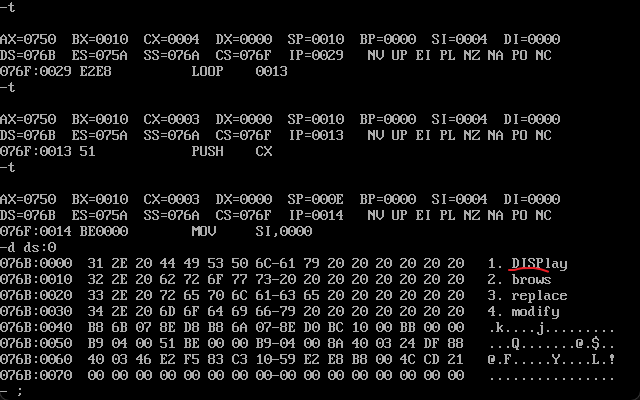
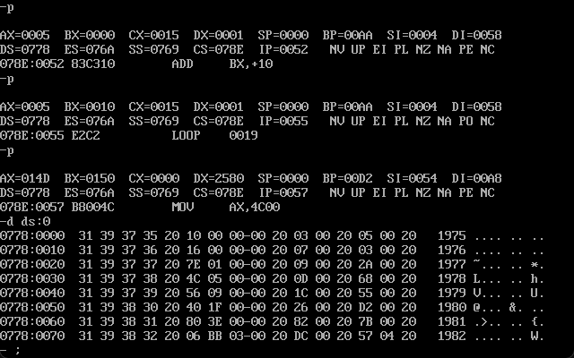
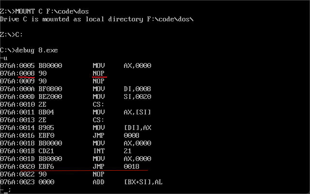
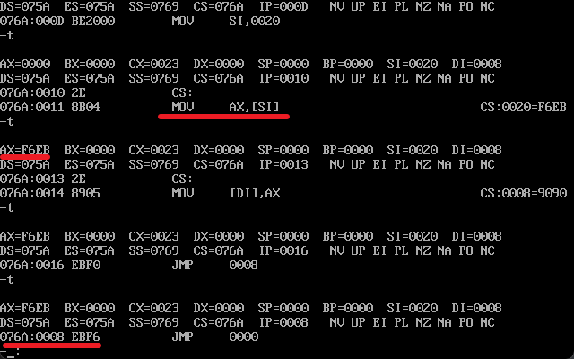
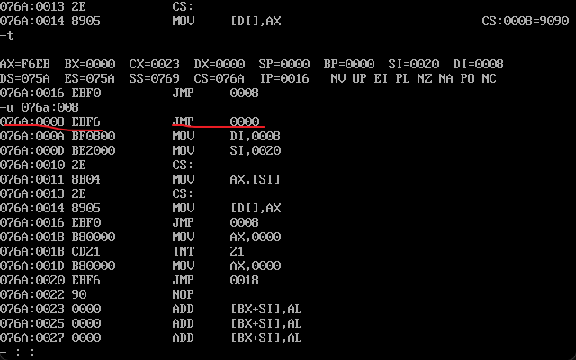
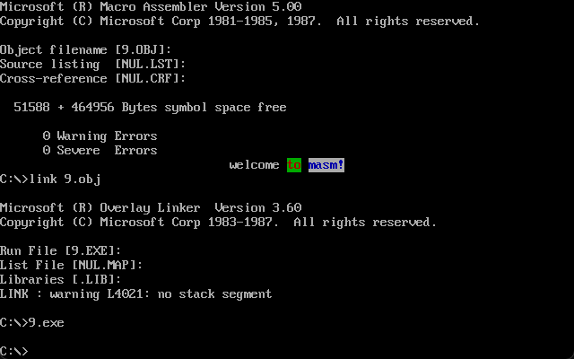
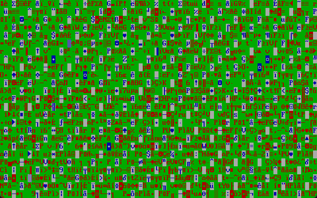

看见满屏花花绿绿我仿佛看见了我太奶
<!-- more -->
## 第7章
### and & or   SI & DI & bp
and指令进行按位与运算，可通过该指令将操作对象对应位设为0。or指令进行按位或运算，可通过改指令将操作对象对应位设为1。这里的按位均按二进制进行。
si，di是8086CPU中和bx功能相近的寄存器，不能作为两个8位寄存器来使用。bp也可以作为偏移地址，但是其默认的段地址在ss中。
mov ax,[bx+si+idata]中的括号内容也可以有以下表现形式：[bx+200+si]，[200+bx+si]，200[bx][si]，[bx].200[si]，[bx][si]200。即可以用一个变量；一个常量；一个变量+一个常量；两个变量；两个变量+一个常量
### 实验6
编程使得给出的字符串的前四个字母变成大写
```
assume cs:codesg,ss:stacksg,ds:datasg

stacksg segment
	dw 0,0,0,0,0,0,0,0
stacksg ends

datasg segment
	db '1. display      '
	db '2. brows        '
	db '3. replace      '
	db '4. modify       '
datasg ends

codesg segment
start: mov ax,datasg
	mov ds,ax

	mov ax,stacksg
	mov ss,ax
	mov sp,16

	mov bx,0
	mov cx,4
   
   s:   push cx
	mov si,0
	mov cx,4

  s0:   mov al,[bx+si+3]   ;因为每行的第一个字母都在第四个，所以+3
	and al,11011111b       ;因为ASCII码表中大写与小写的差距，这一位为1则为小写
	mov [bx+si+3],al
	inc si
	loop s0

	add bx,16
	pop cx
	loop s

	mov ax,4c00h
	int 21h

codesg ends
end start
```
以下为运行中途的结果展示

## 第8章
### 数据
数据可以在三个位置：CPU内部，内存，端口。而表达数据可以有三种概念：立即数（即包含在机器指令中的数据，执行前在CPU的指令缓冲器中），寄存器，段地址和偏移地址（在内存中）。
数据的尺寸可以有两种指明方式，1.通过寄存器指明，类似于mov ax,1为字操作mov al,1为字节操作；2.可以用操作符x ptr完成，类似于mov word ptr[bx],1为一个字单元，mov byte ptr [bx],1为一个字节单元。
### div指令
div是一个除法指令，除数保存在寄存器或者内存单元中，16位的被除数放ax中而32位ax放低16位dx放高16位。结果，8位则al放商，ah放余数；16位则ax放商，dx放余数。
格式类div 内存单元/寄存器 或者 div byte ptr ds:[0]
### db dw dd & dup
在之前定义栈段的时候用过dw，得到的空间为16个字节，而dw也意为为每个数据申请一字的内存，db是一字节，dd是两个字的内存。
dup是一个操作符，与db，dw，dd配合使用，用于数据的重复，也就是定义多少个重复的数。格式为db 重复次数 dup （重复的字节型数据） 格式以此类推。例如需要申请一个容量为200和字节的栈段，db 200 dup(0)。
### 实验7
将已有数据按照一定格式存入空间中，并增加一个位置用于储存计算结果。
```
assume cs:code,ss:stack

data segment
	db '1975','1976','1977','1978','1979','1980','1981','1982','1983'
	db '1984','1985','1986','1987','1988','1989','1990','1991','1992'
	db '1993','1994','1995'

	dd 16,22,382,1356,2390,8000,16000,244486,50065,97479,140417,197514
	dd 345980,590827,803530,1183000,1843000,2759000,3753000,4649000,5937000

	dw 3,7,9,13,28,38,130,220,476,778,1001,1442,2258,2793,4037,5635,8226
	dw 11542,14430,15257,17800

data ends

table segment
	db 21 dup('year sume ne ?? ')
table ends

stack segment
	db 8 dup(0)
stack ends

code segment
starts: mov ax,table
	mov ds,ax

	mov ax,data
	mov es,ax
	
	mov bx,0
	mov si,0   ;year
	mov di,84  ;get
	mov bp,168 ;num

	mov cx,21

    S:  mov ax,es:[si]  ;year
	mov [bx],ax
	add si,2
	mov ax,es:[si]
	mov [bx].2,ax
	add si,2

	mov ax,es:[di]  ;get
	mov [bx].5,ax
	add di,2
	mov ax,es:[di]
	mov [bx].7,ax
	add di,2

	mov ax,es:[bp]   ;num
	mov [bx].10,ax

	mov ax,[bx+5]
	mov dx,[bx+7]
	div word ptr [bx+10]
	mov [bx+13],ax
	add bp,2

	add bx,16
	loop s

	mov ax,4c00h
	int 21h
code ends
end starts
```
下图为效果展示（关于我到了第十章却反复修改了三次这个代码这件事

## 第9章
### offset
修改执行指令的顺寻的指令为转移指令，在8086CPU中转移指令分为：无条件转移指令，条件转移指令，循环指令，过程，中断。转移行为分为了只修改IP的段内转移，修改CS和IP的段间转移。
操作符offset可以获得标号的偏移地址，比如，mov ax,offset start，ax中会保存start标识位置的相对偏移地址。
### jmp
jmp short 标号，段内短转移，对IP的修改范围为-128-127，该指令的机器码中不包含转移的目的地而是偏移地址。
jmp far ptr 标号，段间转移。机器码中包含目的地址，高地址为段地址，低地址为偏移地址。
jmp 寄存器（16位）IP修改为寄存器的内容。
jmp word ptr 内存单元地址（段内转移），单元中存放的是目的偏移地址。
jmp dword ptr 内存单元地址（段间转移），高地址是转移的目的段地址，低地址是转移的目的偏移地址。
### jcxz & loop
jcxz是条件转移地址，所有的有条件转移指令都是段转移，对应机器码中包含转移的位移，而不是目的地址，格式：jcxz 标号。转移条件为cx内容==0。
loop作为循环指令的基础就是loop能根据标号转移，同时cx==0也是loop的条件。
ps：如果源程序中出现了转移范围越界的问题，在编译时编译器会报错。
### 实验8
分析一个奇怪的程序，运行来观察其实现过程，乍一看代码是真的匪夷所思。
```
assume cs:codesg
codesg segment
	mov ax,4c00h  ;估计会跳转到这里完成结束
	int 21h

start: 
    mov ax,0
s:  nop
	nop

    mov di,offset s     ;这里用di将s所处IP记录了，0008h
	mov si,offset s2    ;这里的si记录了s2的偏移地址，0020h
	mov ax,cs:[si]      ;将s2地址的机器码给了ax-F6EB，对应jmp 0018h，向上偏移8个字节
	mov cs:[di],ax      ;将s2标识的机器码存入了s标识处

s0: jmp short s         ;即将跳转到0008，debug-u查看0008为jum 0000，向上偏移8个字节

s1: mov ax,0
	int 21h
	mov ax,0

s2: jmp short s1
	nop

codesg ends
end start

```
以下是过程截图 




### 实验9
在画面中间显示要求的花里胡哨的字符
```
assume cs:codesg,ds:data

data segment
db 'welcome to masm!'
data ends

codesg segment
start:  
    mov ax,data
    mov ds,ax
    mov ax,0b800h  ;在视频内存的情况下，0xB800 是一个常见的地址，用于文本模式下的屏幕显示。它包含一个特殊的显示缓冲区，用于在屏幕上显示文本和字符。
    mov es,ax
	mov di,0
	mov si,40h

	mov cx,07h
s1: mov ah,00000111b  ;显示的有颜色的字高位存储的是花式
	mov al,[di]       ;低地址存储数据
	mov es:[780h+si],ax 
	inc di
	add si,2
	loop s1


	inc di       ;这里是空格的位置
	add si,2

	mov cx,02h
s2: mov ah,00100100b
	mov al,[di]
	mov es:[780h+si],ax
	inc di
	add si,2
	loop s2


	inc di
	add si,2

	mov cx,05h
s3: mov ah,01110001b
	mov al,[di]
	mov es:[780h+si],ax
	inc di
	add si,2
	loop s3

	mov ax,4c00h
	int 21h
codesg ends
end start
```
贴一个效果图

分享一个我不小心把循环的标识写错了的输出效果图，跟吃了菌子一样
